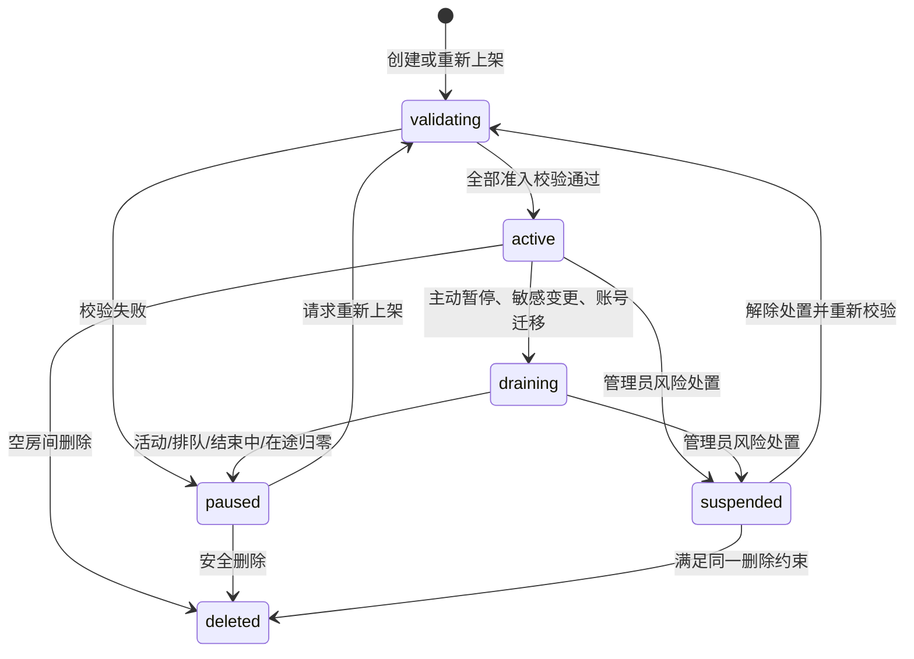
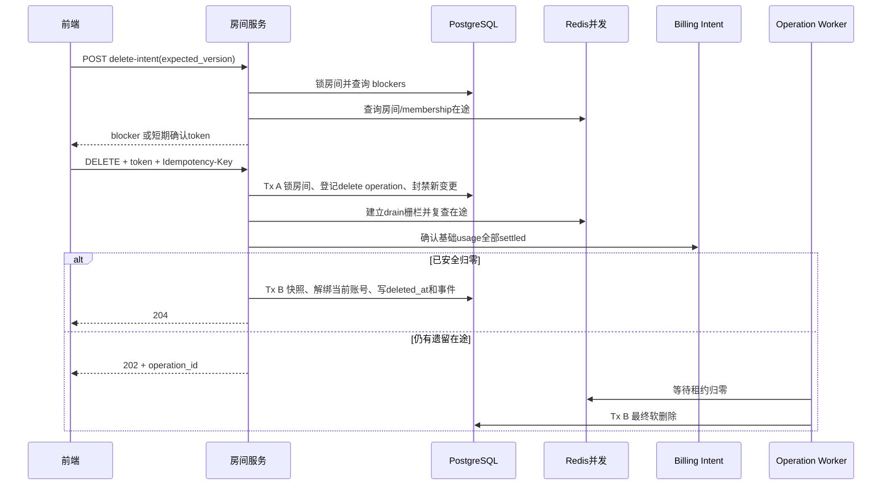

# 账号广场房间生命周期与完整闭环实施方案

**生成日期**：2026-07-27
**复杂度**：高
**文档性质**：产品规则、领域设计与分阶段实施计划；本方案不执行数据库迁移，不修改业务代码。
**适用范围**：账号广场中的房间、房间账号、消费者席位、预约队列、并发调度、计费、评价、暂停、下架、软删除与历史归档。
**规范状态**：本文件是账号广场后续实施的唯一决策基线；其他同主题文件只作为核查草稿，发生冲突时以本文件为准。

## 1. 概述

账号广场当前已经具备多账号房间、席位、队列、预付小时费、使用结算和评价等能力，但这些能力仍然沿用了一部分“单房间单账号”的假设。只在现有页面上增加一个“删除房间”按钮，会造成历史记录消失、容量被高估、在途请求与结算竞态、账号退出误伤用户等问题。

本方案的核心不是补一个删除接口，而是把以下链路一次性闭环：

```text
账号具备房间模式资格
  → 房主受配额约束创建房间
  → 校验账号与配置
  → 房间上架
  → 消费者加入或排队
  → 按房主设置的 1～15 个房间席位准入
  → 按 membership 与账号各自的并发上限执行请求与计费
  → 参数变更、账号故障和安全迁移
  → 用户结束使用
  → 房间排空、暂停或软删除
  → 消费、评价、结算和审计历史永久可查
```

### 1.1 已确定的核心规则

| 主题 | 目标规则 |
| --- | --- |
| 删除方式 | 房间只允许软删除，普通业务禁止物理删除 |
| 删除权限 | 房主可删除自己的房间；管理员也不能绕过活动使用、队列、在途请求和同步结算约束 |
| 删除条件 | 最终删除时无 `active`、`queued`、`ending` membership，无有效编辑会话、无在途请求、无待处理基础 billing intent、无尚未完成的同步结束结算或退款 |
| 账号处理 | 删除时解除当前房间账号关系；账号本身、凭证、代理、状态、并发配置和“房间模式资格”不变 |
| 历史显示 | 使用加入时或配置版本快照显示“原房间名（已删除）” |
| 名称复用 | 最终删除后允许同一房主复用名称，但必须创建新房间 ID |
| 恢复 | 第一版不提供恢复；删除后的房间是只读归档 |
| 审计 | 删除和所有重要变更记录操作者、角色、时间、来源、请求 ID、幂等操作及变更前后快照 |
| 席位口径 | `seat_limit` 完全由房主设置，最少 1、最多 15；只表示房间可同时激活的消费者 membership 数，不由账号数量或账号并发推导 |
| 并发口径 | `per_user_concurrency` 与账号 `concurrency` 只在请求期分别限流；它们不是房间席位依据，也不构成每席位的并发保证 |
| 房主自用 | 房主自用不占对外消费者席位；它与消费者请求一样受 membership 和实际账号并发限制，不新增 `paid/owner` 预留模型 |
| 请求计费屏障 | Redis 请求租约归零不代表计费完成；请求必须先持久化不可变 billing intent，再释放运行时租约 |
| 参数权限 | 房主没有活动房间强制改参权限；管理员保留最高改参权限，但必须二次确认、填写原因、写审计并创建新 revision，既有 membership 继续使用旧条款快照 |

### 1.2 目标

- 给房间、房间账号和 membership 建立明确且可执行的状态机。
- 彻底分离“房间人数上限”和“请求运行时并发”，避免用账号并发反推或限制席位。
- 给每个用户的房间数、每个房间账号数和总绑定账号数建立可配置配额。
- 明确哪些参数可以热更新，哪些必须先排空，哪些不可变。
- 让用户最终确认的加入条款、实际请求路由和最终结算引用同一不可变版本。
- 删除后仍能查看消费、结算、评价、账号绑定时间线和管理审计。
- 所有变更命令具备幂等、乐观锁、稳定锁顺序和结构化冲突原因。
- 对当前已确认问题提供分级修复顺序，并通过在线迁移、灰度和回滚控制风险。

### 1.3 非目标

- 第一版不实现已删除房间恢复。
- 第一版不允许同一账号同时加入多个房间。
- 第一版不做“不同模型自动分片到不同账号”；要求房内每个可分配账号支持房间完整模型集合。
- 第一版不改变账号凭证、代理和普通账号管理的基础模型。
- 本方案不执行现网数据库写入、回填或迁移；实施时必须另行获得数据变更确认。

## 2. 术语与不变量

### 2.1 术语

| 术语 | 含义 |
| --- | --- |
| 房间 / listing | 对外售卖或自用的共享单元；以不可变 `listing_id` 标识 |
| 房间账号 | 当前加入房间、可承载 membership 的账号 |
| 房间模式资格 | 账号允许参加房间模式；删除房间不撤销该资格 |
| membership | 某个消费者 API Key 对房间的一次排队、激活和结束记录 |
| 席位 | 一个非房主的 `active/ending` membership；房主设置的数量上限为 1～15，不承诺底层账号一定提供同等并发 |
| 配置并发 | 账号表中的 `accounts.concurrency` |
| 在途并发 | Redis 租约中当前正在执行的请求数 |
| 房间 revision | 一次不可变的房间配置快照 |
| operation | 一个可能跨事务、可重试的管理操作，例如排空或删除 |

### 2.2 必须长期成立的不变量

1. 一个未删除账号最多属于一个未结束的房间账号关系。
2. `active/ending` membership 必须拥有对应房间的开放账号 binding；`queued` 只绑定已确认 room revision，不预占或强绑账号。
3. 任一房间的消费者 `active/ending` membership 数不得超过房主配置的 `seat_limit`，且 `seat_limit` 必须在 1～15。
4. `active` 房间必须至少有一个兼容、可调度的房间账号；账号并发不足只会在请求期触发明确限流或等待，不得反向改变 `seat_limit`。
5. `deleted_at IS NOT NULL` 的房间不得存在 `active/queued/ending` membership。
6. 已删除房间不得接受加入、编辑、账号增删、重新上架或普通详情读取。
7. membership、settlement、review 和审计历史不得依赖当前房间账号仍然存在。
8. 房间和账号的任何可见名称都不能作为历史关联键；历史只按 ID 和 revision 关联。
9. 金融结算必须使用请求开始时或 membership 激活时固化的快照，不能读取后来修改的房间当前值。
10. 任何管理命令重试都不能产生第二次扣费、退款、账号解绑或重复事件。
11. 每个已发送到上游的请求都必须有持久化 billing intent；Redis 租约归零不能替代该持久化事实。
12. 房主自用不占消费者 `seat_limit`，但必须和所有请求共同遵守绑定账号的真实并发上限；不建立付费/房主分类预留。
13. 同一消费者在同一房间最多有一个 `queued/active/ending` membership；全局最多一个 `active/ending`，队列配额同时按用户和 API Key 约束。
14. 当前房间关系、开放 binding、请求租约或未完成 billing intent 存在时，上游账号不得被普通业务物理删除。

## 3. 当前代码核查结论

以下结论均按 UTF-8 读取并进行了交叉验证。当前未发现已经造成不可恢复生产数据丢失的 P0 证据；下列 P1 是在特定操作条件下会触发的高风险问题。

### 3.1 已确认问题

#### [P1] 当前没有删除房间的服务端与前端契约

- 位置：
  - `C:\Users\寇振琦\Desktop\Codex\api\sub2api-0.1.119\backend\internal\server\routes\user.go:183`
  - `C:\Users\寇振琦\Desktop\Codex\api\sub2api-0.1.119\backend\migrations\179_account_share_mode.sql:118`
  - `C:\Users\寇振琦\Desktop\Codex\api\sub2api-0.1.119\frontend\src\api\accountShare.ts:641`
- 证据：数据库已有 `deleted_at`，但用户路由、服务、仓储和前端 API 均没有 delete intent、finalize、operation 或归档读取能力。
- 影响：当前无法安全删除；若只补一个直接更新 `deleted_at` 的接口，会绕过成员、在途、计费、历史和账号解绑约束。
- 建议：删除只能在历史读模型和 billing barrier 完成后，通过两阶段领域操作开放。
- 置信度：High。

#### [已修复] 席位曾被错误绑定到账号并发，且范围曾是 2～12

- 位置：
  - `C:\Users\寇振琦\Desktop\Codex\api\sub2api-0.1.119\backend\internal\repository\account_share_mode_repo.go:1143`
  - `C:\Users\寇振琦\Desktop\Codex\api\sub2api-0.1.119\backend\internal\repository\account_share_mode_repo.go:1216`
  - `C:\Users\寇振琦\Desktop\Codex\api\sub2api-0.1.119\backend\internal\service\account_share_mode.go:40`
  - `C:\Users\寇振琦\Desktop\Codex\api\sub2api-0.1.119\backend\internal\service\account_share_mode.go:3578`
- 修复证据：服务常量和新增迁移已统一为 `seat_limit=1..15`；创建、更新和前端均已删除 `seat_limit × per_user_concurrency`、账号总并发乘积以及 `floor(concurrency/seats)` 反推逻辑，并补充独立边界测试。
- 当前状态：代码规则已修复；新增迁移尚未执行，实际数据库约束是否生效必须在获得数据库操作授权后单独核验。
- 长期规则：创建、编辑和加入只用房间 live consumer membership 数判断席位，账号数量、账号并发与 `per_user_concurrency` 均不得参与席位合法性或准入计算。
- 置信度：High。

#### [P1] 长请求的 Redis 槽位会过期，但现有 heartbeat 只刷新数据库

- 位置：
  - `C:\Users\寇振琦\Desktop\Codex\api\sub2api-0.1.119\backend\internal\repository\concurrency_cache.go:45`
  - `C:\Users\寇振琦\Desktop\Codex\api\sub2api-0.1.119\backend\internal\repository\concurrency_cache.go:282`
  - `C:\Users\寇振琦\Desktop\Codex\api\sub2api-0.1.119\backend\internal\repository\concurrency_cache.go:383`
  - `C:\Users\寇振琦\Desktop\Codex\api\sub2api-0.1.119\backend\internal\service\account_share_mode.go:3536`
- 证据：account 和 membership 槽位使用默认 15 分钟时间戳过期；请求期间的 heartbeat 只更新 membership `last_request_at`，没有续租 Redis ZSET 中的 request token。
- 影响：超过 TTL 的流式或长任务仍在执行时，槽位可能被清理，造成并发超卖；排空、解绑或删除也可能误判在途为零。
- 建议：account 与 membership 租约使用同一 request token 定期续租，续租失败立即进入可观测的 fail-closed 状态；TTL 只用于进程崩溃回收。
- 置信度：High。

#### [P1] membership 并发依赖缺失时会静默 fail-open

- 位置：
  - `C:\Users\寇振琦\Desktop\Codex\api\sub2api-0.1.119\backend\internal\service\account_share_mode.go:3496`
  - `C:\Users\寇振琦\Desktop\Codex\api\sub2api-0.1.119\backend\internal\service\concurrency_service.go:403`
  - `C:\Users\寇振琦\Desktop\Codex\api\sub2api-0.1.119\backend\internal\service\openai_gateway_service.go:2185`
- 证据：service、cache 或 membership concurrency 接口缺失时返回 `Acquired=true` 的 no-op；账号槽位在 concurrency service 缺失时也直接成功。
- 影响：生产装配或依赖异常会让单用户和账号并发限制静默失效，既无硬失败也难以及时发现。
- 建议：账号广场请求路径必须 fail-closed，并把依赖完整性纳入启动 readiness、告警和故障注入测试。
- 置信度：High。

#### [P1] Redis 归零早于 usage billing 持久化

- 位置：
  - `C:\Users\寇振琦\Desktop\Codex\api\sub2api-0.1.119\backend\internal\handler\openai_gateway_handler.go:494`
  - `C:\Users\寇振琦\Desktop\Codex\api\sub2api-0.1.119\backend\internal\handler\openai_gateway_handler.go:619`
  - `C:\Users\寇振琦\Desktop\Codex\api\sub2api-0.1.119\backend\internal\handler\gateway_handler.go:442`
  - `C:\Users\寇振琦\Desktop\Codex\api\sub2api-0.1.119\backend\internal\handler\gateway_handler.go:519`
- 证据：Forward 完成后先释放 account/membership 槽位，再把 usage 任务提交到进程内 worker；钱包扣费、分账、settlement 和 usage log 此后才进入数据库事务。
- 影响：排空、重绑或删除可能把“Redis 为零”误当成请求已完整落账；进程在释放后、worker 提交前崩溃还存在 usage、扣费与分账丢失窗口。
- 建议：请求发往上游前创建持久化 billing intent，完成后先把 usage payload 持久化为 ready，再逆序释放租约；worker 只负责幂等结算。
- 置信度：High。

#### [P1] 软删除或最后账号退出后，消费者历史入口会消失

- 位置：
  - `C:\Users\寇振琦\Desktop\Codex\api\sub2api-0.1.119\backend\internal\repository\account_share_mode_repo.go:517`
  - `C:\Users\寇振琦\Desktop\Codex\api\sub2api-0.1.119\backend\internal\repository\account_share_mode_repo.go:860`
  - `C:\Users\寇振琦\Desktop\Codex\api\sub2api-0.1.119\backend\internal\repository\account_share_mode_repo.go:5195`
  - `C:\Users\寇振琦\Desktop\Codex\api\sub2api-0.1.119\backend\internal\repository\account_share_room_repo.go:441`
- 证据：历史列表强制 `l.deleted_at IS NULL`；消费详情又强制要求当前存在一个房间代表账号；最后账号退出会删除当前关系。
- 影响：尚未删除但已无账号的房间也可能使消费详情返回 404；软删除后无法显示“已删除”历史。
- 建议：消费者历史、消费详情和评价从 membership/revision 快照读取。
- 置信度：High。

#### [P1] 历史外键存在级联删除与限制删除的矛盾

- 位置：
  - `C:\Users\寇振琦\Desktop\Codex\api\sub2api-0.1.119\backend\migrations\179_account_share_mode.sql:155`
  - `C:\Users\寇振琦\Desktop\Codex\api\sub2api-0.1.119\backend\migrations\179_account_share_mode.sql:190`
  - `C:\Users\寇振琦\Desktop\Codex\api\sub2api-0.1.119\backend\migrations\195_account_share_reviews.sql:118`
- 证据：membership 到 listing/account/API Key 以及 review 到 membership 有 `ON DELETE CASCADE`；settlement 到相关主体又使用 `RESTRICT`。
- 影响：同一个误硬删动作会因是否已有结算而表现为“级联抹除历史”或“删除失败”，生命周期不稳定。
- 建议：业务永久软删除；历史主链改为 `RESTRICT`，可被合规删除的展示主体采用 nullable FK 加不可变快照。
- 置信度：High。

#### [P1] 上游账号可以绕过房间生命周期被直接物理删除

- 位置：
  - `C:\Users\寇振琦\Desktop\Codex\api\sub2api-0.1.119\backend\internal\service\account_service.go:1725`
  - `C:\Users\寇振琦\Desktop\Codex\api\sub2api-0.1.119\backend\internal\repository\account_repo.go:974`
  - `C:\Users\寇振琦\Desktop\Codex\api\sub2api-0.1.119\backend\internal\service\api_key_service.go:1001`
- 证据：`DeleteOwned` 直接调用账号仓储物理删除；账号侧没有复用 API Key 已有的 active/queued binding checker。
- 影响：无 settlement 阻止时可能级联清除当前关系或 membership；有 settlement 时操作又会因 `RESTRICT` 失败，行为依赖历史数据。
- 建议：账号删除先检查当前 assignment、开放 binding、请求租约和 billing intent；普通业务改为软删除，历史引用使用 nullable FK 加快照。
- 置信度：High。

#### [P1] 房间账号退出会在同一事务内直接重绑或强制结束使用

- 位置：
  - `C:\Users\寇振琦\Desktop\Codex\api\sub2api-0.1.119\backend\internal\repository\account_share_room_repo.go:426`
  - `C:\Users\寇振琦\Desktop\Codex\api\sub2api-0.1.119\backend\internal\repository\account_share_room_repo.go:1175`
  - `C:\Users\寇振琦\Desktop\Codex\api\sub2api-0.1.119\backend\internal\repository\account_share_room_repo.go:1299`
- 证据：退出先标记 `draining`，随后直接覆盖活动/排队 membership 的 `account_id`；没有替代账号时暂停房间并结束活动、排队 membership。
- 影响：可能在请求仍使用旧账号时覆盖绑定；最后账号退出会结束消费者使用，但前端操作语义不足以表达该影响。
- 建议：账号退出变成长生命周期 drain；只在 membership 在途为零且目标账号兼容、健康、可路由时关闭旧绑定并建立新绑定。
- 置信度：High。

#### [P1] 添加账号校验不完整，并会把任意 paused 房间自动恢复为 active

- 位置：
  - `C:\Users\寇振琦\Desktop\Codex\api\sub2api-0.1.119\backend\internal\repository\account_share_room_repo.go:285`
  - `C:\Users\寇振琦\Desktop\Codex\api\sub2api-0.1.119\backend\internal\repository\account_share_room_repo.go:373`
  - `C:\Users\寇振琦\Desktop\Codex\api\sub2api-0.1.119\backend\internal\service\openai_account_scheduler.go:1442`
- 证据：attach 只核对所有者、平台、等级和房间模式资格，没有验证账号状态、可调度性、并发和房间完整模型集合；随后会把 `paused` 自动改为 `active`。请求阶段才可能因模型不支持而报错。
- 影响：人工暂停、验证失败或没有可路由账号的房间可能因添加账号被意外重新上架。
- 建议：attach 只增加候选账号并触发验证；恢复必须走显式 `activate` 命令。
- 置信度：High。

#### [P1] 房间编辑锁遗漏 queued、房主自用和模型单独修改

- 位置：
  - `C:\Users\寇振琦\Desktop\Codex\api\sub2api-0.1.119\backend\internal\repository\account_share_mode_repo.go:1194`
  - `C:\Users\寇振琦\Desktop\Codex\api\sub2api-0.1.119\backend\internal\repository\account_share_mode_repo.go:6161`
  - `C:\Users\寇振琦\Desktop\Codex\api\sub2api-0.1.119\backend\internal\service\account_share_mode.go:2621`
- 证据：活动席位统计排除房主且只统计 `active`；model-only 更新绕过编辑会话。
- 影响：排队用户可能在不知情时面对新条款；活动用户请求的模型可能在使用期间被移除。
- 建议：使用统一参数矩阵；房主的合同类更新要求 `active/queued/ending/in-flight` 全部为零，管理员强制更新必须创建新 revision 并保留既有 membership 条款。
- 置信度：High。

#### [P1] 管理员强制改参缺少不可变条款隔离

- 位置：
  - `C:\Users\寇振琦\Desktop\Codex\api\sub2api-0.1.119\backend\internal\repository\account_share_mode_repo.go:1198`
  - `C:\Users\寇振琦\Desktop\Codex\api\sub2api-0.1.119\backend\internal\service\account_share_mode.go:4710`
  - `C:\Users\寇振琦\Desktop\Codex\api\sub2api-0.1.119\backend\internal\service\openai_gateway_service.go:7398`
- 证据：`ForceActiveEdit` 允许管理员绕过活动席位限制；请求结算倍率仍会读取 listing 当前配置。
- 影响：同一 membership 的后续请求可能在没有重新同意的情况下改变价格。
- 建议：保留管理员最高改参能力，但强制要求 reason、二次确认和审计；每次强制修改创建新 revision，现有 active/queued/ending membership 与它们的后续请求继续读取旧 revision，只有修改后新建的 membership 使用新 revision。房主不得提交 `force_active_edit`。
- 置信度：High。

#### [P1] 用户确认的加入条款没有与最终加入事务绑定

- 位置：
  - `C:\Users\寇振琦\Desktop\Codex\api\sub2api-0.1.119\frontend\src\views\user\AccountShareView.vue:1836`
  - `C:\Users\寇振琦\Desktop\Codex\api\sub2api-0.1.119\frontend\src\views\user\AccountShareView.vue:6762`
  - `C:\Users\寇振琦\Desktop\Codex\api\sub2api-0.1.119\frontend\src\api\accountShare.ts:656`
- 证据：确认弹窗展示前端内存中的 listing 价格、模型和并发，确认后直接调用 join；没有服务端 join intent、room revision、row version 或一次性条款 token。
- 影响：弹窗打开后房间被修改时，用户看到的条款与最终激活、预付或排队条款可能不同。
- 建议：增加服务端 join intent；最终 join 必须携带一次性 token、expected revision 和是否接受排队，条款变化返回 409 并要求重新确认。
- 置信度：High。

#### [P1] 普通账号编辑可以绕过房间运行安全边界

- 位置：
  - `C:\Users\寇振琦\Desktop\Codex\api\sub2api-0.1.119\backend\internal\service\account_service.go:1538`
  - `C:\Users\寇振琦\Desktop\Codex\api\sub2api-0.1.119\backend\internal\service\account_service.go:1584`
  - `C:\Users\寇振琦\Desktop\Codex\api\sub2api-0.1.119\backend\internal\service\account_service.go:1592`
  - `C:\Users\寇振琦\Desktop\Codex\api\sub2api-0.1.119\backend\internal\service\account_service.go:2318`
- 证据：账号所有者可以直接修改 concurrency、status 和 schedulable；当前仅在改变外部投放模式时检查账号是否仍在房间。
- 影响：房间创建后可直接降低账号并发或禁用账号，使已绑定请求突然限流或不可用；这不改变席位上限，但会破坏运行稳定性。
- 建议：所有影响房间运行的账号更新都进入统一账号 drain/健康协调器；账号并发仍只负责请求期限流，不参与席位计算。
- 置信度：High。

#### [P1] 创建和批量账号操作的幂等键没有完整语义

- 位置：
  - `C:\Users\寇振琦\Desktop\Codex\api\sub2api-0.1.119\backend\internal\service\account_share_mode.go:1912`
  - `C:\Users\寇振琦\Desktop\Codex\api\sub2api-0.1.119\backend\internal\repository\account_share_room_repo.go:42`
  - `C:\Users\寇振琦\Desktop\Codex\api\sub2api-0.1.119\backend\internal\service\account_share_mode.go:2074`
  - `C:\Users\寇振琦\Desktop\Codex\api\sub2api-0.1.119\backend\internal\service\account_share_mode.go:2097`
- 证据：创建只检查 key 是否为空；批量操作只规范化 key 后逐账号、逐事务执行，没有持久化 payload hash 或稳定重放结果。
- 影响：网络超时重试可能产生多个房间或部分成功；同 key 不同 payload 不能稳定返回冲突。
- 建议：复用现有通用幂等协调器，强制 Header `Idempotency-Key`、payload fingerprint 和结果重放；批量变更默认全有或全无。
- 置信度：High。

#### [P1] 正在使用的用户可能看不到结束入口

- 位置：
  - `C:\Users\寇振琦\Desktop\Codex\api\sub2api-0.1.119\frontend\src\views\user\AccountShareView.vue:1661`
  - `C:\Users\寇振琦\Desktop\Codex\api\sub2api-0.1.119\frontend\src\views\user\AccountShareView.vue:4778`
  - `C:\Users\寇振琦\Desktop\Codex\api\sub2api-0.1.119\backend\internal\repository\account_share_mode_repo_unit_test.go:1137`
- 证据：使用状态面板以 `queue_membership_id` 为外层条件，但合法活动响应可以只有 `current_membership_id`；加入区又在有 `current_membership_id` 时隐藏。
- 影响：用户既看不到使用面板，也不能主动结束，可能持续占位和计费。
- 建议：状态面板条件改为 `current_membership_id || queue_membership_id`，并增加活动态回归测试。
- 置信度：High。

#### [P1] 实时并发字段把代表账号分子与全房间分母混在一起

- 位置：
  - `C:\Users\寇振琦\Desktop\Codex\api\sub2api-0.1.119\backend\internal\repository\account_share_mode_repo.go:5397`
  - `C:\Users\寇振琦\Desktop\Codex\api\sub2api-0.1.119\backend\internal\service\account_share_mode.go:2785`
  - `C:\Users\寇振琦\Desktop\Codex\api\sub2api-0.1.119\frontend\src\views\user\AccountShareView.vue:4658`
  - `C:\Users\寇振琦\Desktop\Codex\api\sub2api-0.1.119\backend\internal\repository\account_share_room_repo.go:235`
  - `C:\Users\寇振琦\Desktop\Codex\api\sub2api-0.1.119\frontend\src\components\account-share\RoomAccountsDialog.vue:157`
- 证据：`account_concurrency` 是房间账号配置并发之和；runtime enrichment 只读取代表账号并发；前端展示为 `current / account`。账号弹窗的 `current_concurrency` 实际扫描 `a.concurrency` 配置值。
- 影响：容量条、推荐评分和账号弹窗名称均可能误导。
- 建议：拆成房间席位、账号配置总并发、实时在途和等待数，不再复用含义模糊的字段；并发指标不得换算成席位。
- 置信度：High。

#### [P1] 前端仍用账号并发和席位反推单用户并发

- 位置：
  - `C:\Users\寇振琦\Desktop\Codex\api\sub2api-0.1.119\frontend\src\views\user\AccountShareView.vue:3588`
  - `C:\Users\寇振琦\Desktop\Codex\api\sub2api-0.1.119\frontend\src\views\user\AccountShareView.vue:3604`
  - `C:\Users\寇振琦\Desktop\Codex\api\sub2api-0.1.119\frontend\src\views\user\AccountShareView.vue:3914`
- 证据：编辑器使用 `floor(account_concurrency / seat_limit)` 推导单用户并发，并校验 `per_user_concurrency × seat_limit <= account_concurrency`。
- 影响：改变席位会无故改变单用户并发上限，低并发账号也无法创建合法的 1～15 人房间。
- 建议：席位只校验 1～15；`per_user_concurrency` 独立校验为正整数并由请求期 membership lease 执行。前端可显示 `seat_limit-active_seats`，但必须把账号健康与请求并发作为独立状态展示。
- 置信度：High。

#### [P1] 批量退出账号缺少影响确认，操作中仍可关闭并重复触发

- 位置：
  - `C:\Users\寇振琦\Desktop\Codex\api\sub2api-0.1.119\frontend\src\components\account-share\RoomAccountsDialog.vue:185`
  - `C:\Users\寇振琦\Desktop\Codex\api\sub2api-0.1.119\frontend\src\components\account-share\RoomAccountsDialog.vue:748`
  - `C:\Users\寇振琦\Desktop\Codex\api\sub2api-0.1.119\frontend\src\components\BaseDialog.vue:29`
  - `C:\Users\寇振琦\Desktop\Codex\api\sub2api-0.1.119\frontend\src\components\BaseDialog.vue:315`
- 证据：批量退出点击后直接发请求；只禁用底部关闭按钮，Header X 和 Escape 仍会 emit close，子组件也没有 operating close guard。
- 影响：用户看不到迁移、容量和最后账号影响；请求未决时可关窗重开并重复提交，放大当前非原子批量操作的风险。
- 建议：Sprint 0 先加 preflight/影响确认和所有关闭路径守卫；正常批量 detach 只允许全有或全无，长时间排空使用单独 operation。
- 置信度：High。

#### [P1] 房主没有暂停、排空、删除和归档的完整管理入口

- 位置：
  - `C:\Users\寇振琦\Desktop\Codex\api\sub2api-0.1.119\frontend\src\views\user\AccountShareView.vue:1635`
  - `C:\Users\寇振琦\Desktop\Codex\api\sub2api-0.1.119\frontend\src\api\accountShare.ts:641`
  - `C:\Users\寇振琦\Desktop\Codex\api\sub2api-0.1.119\backend\internal\service\account_share_mode.go:2559`
- 证据：暂停按钮仅管理员可见；当前类型和 API 没有 owner drain/pause、delete operation、archive、quota/capabilities 或 `allowed_actions`。
- 影响：房主无法先停止接新用户再安全调整或删除，只能依赖间接状态变化，业务流程无法闭环。
- 建议：由服务端 management-state 返回动作能力和 blocker，前端提供“暂停接入 → 排空 → 调整/删除 → 显式恢复”的完整路径。
- 置信度：High。

#### [P1] 多账号房间评价仍可能归到初始账号

- 位置：
  - `C:\Users\寇振琦\Desktop\Codex\api\sub2api-0.1.119\backend\internal\repository\account_share_room_repo.go:158`
  - `C:\Users\寇振琦\Desktop\Codex\api\sub2api-0.1.119\backend\internal\repository\account_share_mode_repo.go:1917`
  - `C:\Users\寇振琦\Desktop\Codex\api\sub2api-0.1.119\backend\internal\repository\account_share_mode_repo.go:1962`
- 证据：创建时把初始账号 identity 写到 listing；评价优先使用 listing identity，而 membership 后续可能已经绑定其他账号。
- 影响：评分对象与实际服务账号不一致，房间信誉数据失真。
- 建议：评价对象改为房间和房主；账号质量通过实际请求的 binding/settlement 派生。
- 置信度：High。

#### [P2] 当前没有建房数量和房间账号数量配额

- 位置：
  - `C:\Users\寇振琦\Desktop\Codex\api\sub2api-0.1.119\backend\internal\service\account_share_mode.go:1901`
  - `C:\Users\寇振琦\Desktop\Codex\api\sub2api-0.1.119\backend\internal\repository\account_share_room_repo.go:42`
- 证据：创建流程验证账号和房间配置后直接写入，没有所有者配额检查；attach 也没有每房间或所有者总账号配额。
- 影响：单用户可以创建大量暂停或活动房间、绑定大量账号，放大校验、列表、队列和运维成本。
- 建议：增加全局默认配额、用户覆盖和并发创建原子校验。
- 置信度：High。

#### [P2] 房间维度没有预约队列总上限

- 位置：
  - `C:\Users\寇振琦\Desktop\Codex\api\sub2api-0.1.119\backend\internal\repository\account_share_mode_repo.go:1571`
  - `C:\Users\寇振琦\Desktop\Codex\api\sub2api-0.1.119\backend\internal\service\account_share_mode.go:60`
- 证据：当前只限制每个消费者 API Key 最多 5 个活动或排队项，没有按房间限制等待人数。
- 影响：热门房间可积累无界等待项，增加调度扫描和过期数据。
- 建议：增加房间队列上限和过期时间。
- 置信度：High。

#### [P2] 现有队列上限口径容易被误读，并可被多 API Key 绕过

- 位置：
  - `C:\Users\寇振琦\Desktop\Codex\api\sub2api-0.1.119\backend\internal\repository\account_share_mode_repo.go:1571`
  - `C:\Users\寇振琦\Desktop\Codex\api\sub2api-0.1.119\backend\internal\service\account_share_mode.go:60`
- 证据：当前“5”统计的是单 API Key 的 `active + queued`，并不是“1 active + 5 queued”；用户创建多个 API Key 时也没有消费者用户维度的总队列限制。
- 影响：产品文案与真实可排队数量不一致，且可通过多 Key 放大等待项。
- 建议：目标规则统一为每个消费者全局最多 `1 active/ending + 5 queued`，并同时保留 API Key 维度 5 queued 上限。
- 置信度：High。

### 3.2 待确认风险

#### 手动结束与在途请求的结算顺序

- 手动 `EndMembership` 会直接结算并写 `ended`：
  - `C:\Users\寇振琦\Desktop\Codex\api\sub2api-0.1.119\backend\internal\service\account_share_mode.go:3068`
  - `C:\Users\寇振琦\Desktop\Codex\api\sub2api-0.1.119\backend\internal\repository\account_share_mode_repo.go:1738`
- 自动空闲结束和故障暂停会先检查 membership Redis 并发：
  - `C:\Users\寇振琦\Desktop\Codex\api\sub2api-0.1.119\backend\internal\service\account_share_mode.go:3344`
  - `C:\Users\寇振琦\Desktop\Codex\api\sub2api-0.1.119\backend\internal\service\account_share_mode.go:3374`

“Redis 归零早于 usage billing 持久化”已经作为独立 P1 确认；本项仍待确认的是手动结束在现有 waiver、预付续期和异步 usage 组合下，会具体造成重复结算、漏记 usage，还是仅产生可补偿的短暂状态不一致。结论必须通过真实 PostgreSQL、Redis、worker 和长流端到端故障注入获得，不能仅凭调用顺序推断最终账务结果。

### 3.3 误判撤销

- **“已有账号建房要求前端排除 room、后端却要求预先是 room，因此入口必然不可用”已撤销。** 当前 `CreateRoomFromOwnedAccount` 会在仓储事务内通过 `prepareAccountForRoomCreationInTx` 转换 placement；前端允许 private/public_pool 且排除已经属于房间的账号，与该目标并不矛盾。仍需测试转换与回滚，但不能再定性为已确认故障。
- **“席位必须按账号并发装箱并预留”已撤销。** 用户最终确认 `seat_limit` 是房主独立设置的消费者人数上限（1～15），账号并发只在请求期限制真实请求；不得再引入 `Σ floor(Ci/P)`、逐账号席位预留或 `paid/owner` 分类租约。
- **“管理员不得强制修改活动房间参数”已撤销。** 管理员保留最高改参权限；正确修复是 revision 与 membership 条款快照隔离，而不是删除管理员能力。房主仍不得使用强制编辑。

## 4. 目标领域模型

### 4.1 房间生命周期与健康态分离

房间业务状态与账号瞬时健康不能混为一个字段：

- 生命周期状态：`validating / active / draining / paused / suspended`
- 终态：`deleted_at IS NOT NULL`
- 计算健康态：`healthy / degraded / unavailable`



说明：

- `draining` 禁止新加入和队列激活，但允许已经开始的请求完成。
- `suspended` 是风险处置，不是删除捷径；管理员仍不能绕过删除约束。
- `disabled` 现有语义拆分为 `paused` 或 `suspended`，通过 `reason_code` 表达原因。
- `health_state` 由账号可调度性、模型能力、配额保护和运行时故障计算，不因一次 429 就改写生命周期。

### 4.2 房间状态转换表

| 当前状态 | 命令 | 前置条件 | 目标状态 | 失败行为 |
| --- | --- | --- | --- | --- |
| 不存在 | create | 配额、名称、席位 1～15、账号资格通过 | validating | 原子回滚 |
| validating | validation-pass | 至少一个房间账号兼容且可调度 | active | 写 revision/event |
| validating | validation-fail | 任一硬性校验失败 | paused | 保存结构化失败原因 |
| active | drain | 权限和 expected version 通过 | draining | 禁止新加入/激活 |
| draining | finalize-pause | live membership 与在途归零 | paused | 不强制终止在途请求 |
| paused/suspended | activate | 重新验证账号、模型和配置 | validating | 不直接 active |
| active/draining | suspend | 管理员风险处置 | suspended | 新请求失败关闭 |
| active/paused/suspended | delete | 删除约束全部满足 | deleted_at | 不满足则 409 blocker |
| deleted | 任意变更 | 永远禁止 | deleted | 返回已删除错误 |

### 4.3 Membership 状态机

目标状态为：

```text
queued → active → ending → ended
   │        │         │
   └──────→ ended     └─ 仅在在途归零和同步结算成功后完成
```

- `queued`：不预付、不占活动席位；有过期时间。
- `active`：占用一个房间席位，绑定一个账号和一个房间 revision；不预留账号并发。
- `ending`：拒绝新请求，保留账号绑定和计费上下文，等待在途请求归零。
- `ended`：同步结束结算、退款完成，可进入历史和评价。
- 暂停或短暂账号故障时，优先保持 `active` 并迁移账号；只有无法提供服务时才进入 `ending` 或按明确产品规则重新排队。

### 4.4 房间账号状态

| 状态 | 可接受新席位 | 可接受已有绑定的新请求 | 可被删除关系 |
| --- | --- | --- | --- |
| validating | 否 | 否 | 是 |
| active | 是 | 是 | 否，必须先 drain |
| draining | 否 | 仅允许已开始请求完成 | 在绑定与在途归零后 |
| failed | 否 | 否 | 在绑定迁移或结束后 |

当前 `account_share_room_accounts` 继续作为实时投影；历史通过 assignment 区间表保存。

## 5. 并发、席位与容量模型

### 5.1 房间席位是独立的成员上限

`seat_limit` 只表示房主允许同时激活的消费者人数，合法范围固定为 `1..15`：

```text
live_consumer_memberships =
  count(active/ending 且 consumer_user_id != owner_user_id)

admission_remaining_seats =
  max(0, seat_limit - live_consumer_memberships)
```

准入规则只有以下三条：

1. 加入事务先锁 listing，再统计 live consumer membership；
2. `live_consumer_memberships < seat_limit` 才能激活，否则按已确认的排队规则进入 queued；
3. 并发 join 必须在同一事务和数据库约束下串行，不能在前端或事务外先查后写。

账号数量、单账号并发、房间账号并发总和、`per_user_concurrency` 都不参与上述公式。不得实现 `Σ floor(Ci/P)`、逐账号席位装箱、席位并发预留或按账号容量自动修改 `seat_limit`。

### 5.2 房间账号只决定可路由性

房间要接受新 membership，仍必须至少存在一个当前可路由账号。可路由账号应同时满足：

1. 房间账号关系为 `active`；
2. 账号未删除且 `status=active`；
3. `schedulable=true` 且未过期；
4. 平台、账号等级和请求模型与房间条款兼容；
5. 没有永久性凭证或资格错误。

这是一项运行可用性前置条件，不是席位换算公式。临时 rate limit、overload、账号并发占满或额度保护只影响当前请求是否能立即取得 account lease；持续不可用时房间进入 `degraded/unavailable` 并停止新激活，但不静默改小房主设置的席位。

激活 membership 时可以按健康、优先级与实时负载选择初始账号并建立 binding。选择策略服务于路由均衡，不产生“该账号分配了几个席位”的持久化概念。

### 5.3 请求期双层并发

设 membership 条款中的单用户并发上限为 `P`，实际绑定账号配置并发为 `Ci`。每个请求依次获取：

1. membership 并发租约，上限 `P`；
2. 绑定账号并发租约，上限 `Ci`；
3. 请求路由快照：membership ID、listing ID、account ID、binding ID、revision ID、条款版本。

`P` 是用户请求上限，不是保证并发；当账号当前没有空闲槽位时，请求返回现有明确限流/等待结果。`P` 与 `Ci` 都必须为正整数并各自校验，但不与 `seat_limit` 相乘或互相反推。

账号租约失败时必须立即、幂等地释放 membership 租约。租约使用唯一 token、TTL 和 heartbeat，释放必须校验 token，避免旧请求释放新租约。

heartbeat 必须同时续租 membership 与 account 的 Redis token，间隔小于 TTL 的三分之一；只更新数据库 `last_request_at` 不算续租。续租失败时停止接受同一 membership 的新请求并告警，管理操作继续把该请求视为在途，直到持久化状态明确或人工处置。

账号广场的 Redis/cache/interface 依赖缺失或调用失败时，请求准入必须 fail-closed；启动 readiness 应提前阻止错误装配实例接流量。房间 drain、账号迁移和删除依赖“拒绝新租约 + 等待旧租约归零”的栅栏，不把 Redis 查询失败当作零并发。

### 5.4 房主自用

- 房主自用不占消费者 `seat_limit`，也不新增额外席位配置。
- 房主只免房间席位小时费和账号广场分账，不代表底层模型 usage 完全免费；usage 仍按全局自用倍率正常记录与扣费。
- 房主和消费者使用相同的 membership lease、account lease 与 billing intent 流程，共同受账号真实 `Ci` 限制。
- 不引入 `paid/owner` 分类租约、付费席位预留、房主预留席位或 owner ceiling；账号忙时所有请求按既有公平调度和限流策略处理。

### 5.5 API 字段重新命名

| 新字段 | 含义 |
| --- | --- |
| `seat_limit` | 房主设置的消费者成员上限，1～15 |
| `active_seats` | 当前非房主 active membership 数 |
| `ending_seats` | 正在结束且仍占房间席位的非房主 membership 数 |
| `admission_remaining_seats` | `max(0, seat_limit-active_seats-ending_seats)` |
| `configured_total_concurrency` | 所有当前房间账号配置并发总和，仅展示 |
| `eligible_total_concurrency` | 当前可路由账号配置并发总和，仅展示 |
| `in_flight_concurrency` | 房间所有账号实时在途总和 |
| `waiting_request_count` | 实时等待请求总数 |
| `pending_billing_intent_count` | 尚未完成基础 usage 落账的持久化请求数 |
| `health_state` | healthy/degraded/unavailable |

废弃含义模糊的 `account_concurrency/current_concurrency` 组合，保留一段兼容期但不再用于席位、加入或参数合法性判定。

### 5.6 请求完成与计费屏障

运行时租约只回答“上游请求是否仍在执行”，不能回答“usage 是否已持久化、扣费是否已完成”。目标顺序为：

1. 解析并重验路由后，以稳定 `request_id` 写入 `billing_intent(status=created)`，固化 membership、listing、account、binding、room revision、条款和路由快照；
2. 获取 membership lease，再获取 account lease；
3. 租约成功后把 intent 改为 `in_flight`，再执行 Forward，并持续续租；
4. Forward 完成后把 usage payload、响应摘要和完成时间持久化，原子改为 `ready`；
5. 只有 `ready` 已提交后，才按 account → membership 的逆序释放租约；
6. billing worker 幂等消费 intent，完成 usage log、钱包/订阅扣费、分账和 settlement，改为 `settled`；
7. worker 或进程崩溃时从数据库 intent 恢复，不能依赖进程内队列。

请求发出前 intent 写入或状态转换失败时不得请求上游；未发送请求的 created intent 可安全取消。Forward 后 usage payload 持久化失败时保持可续租的 lifecycle barrier 并重试；不能先释放再仅记录日志。失败或长期未决 intent 会阻止结束、重绑、解绑和删除，并进入告警/人工处置。

正常结束和删除要求该 membership 的基础 usage intent 全部 `settled`。后续幂等的 waiver compensation、对账冲正和报表重算不阻止软删除，因为它们只依赖保留快照追加记录。

## 6. 用户建房和账号配额

### 6.1 配额依据

建房上限不应按余额、普通用户请求并发或房间账号并发自动变化：

- 余额容易被充值和消费波动，不代表治理可信度。
- 账号并发只决定请求期吞吐，不决定房间席位或用户应创建多少房间。
- 房间数量主要影响校验任务、列表、队列、审计、调度和运营治理成本。

第一版采用“全局默认 + 用户显式覆盖”，以后如有实名认证或信誉等级，再增加受控 tier；不在没有信誉基础设施时虚构自动等级。

### 6.2 推荐初始值

这些是建议的安全起始值，必须先以影子指标观察现网 7 至 14 天再正式拦截：

| 配额 | 推荐默认值 | 统计口径 |
| --- | ---: | --- |
| 每用户未删除房间数 | 5 | 包含 validating、active、draining、paused、suspended |
| 每用户 24 小时成功创建房间数 | 5 | 创建成功即计入；当天删除不返还 |
| 每房间当前账号数 | 20 | 包含 validating、active、draining |
| 每用户所有房间当前账号总数 | 100 | 只统计未删除房间的当前关系 |
| 每消费者全局活动关系 | 1 | `active + ending`，跨所有 API Key |
| 每消费者全局预约项 | 5 | 所有 API Key 的未过期 queued 总和 |
| 每 API Key 预约项 | 5 | 未过期 queued；与用户维度同时满足 |
| 每房间等待人数 | `min(100, max(20, seat_limit × 10))` | 只统计未过期 queued |
| 预约有效期 | 2 小时 | 过期自动 ended，原因 `queue_expired` |

### 6.3 计数与并发创建

- 软删除房间不再计入房间配额；draining 和 paused 仍计入，防止靠暂停绕过。
- 软删除不返还 24 小时创建频控，否则可通过创建—删除循环无限制造永久历史。
- 超限历史用户生成 grandfather override：可以管理、排空和删除已有房间，但不能新建或继续添加账号。
- 管理员覆盖必须有有效期、原因和审计，不提供静默无限额。
- 创建房间时使用所有者维度 advisory lock 或专用 quota row 锁，再执行 live count；不能“先 count、后 insert”。
- 不建议锁 `users` 余额行来实现房间配额，以免与加入和计费锁产生不必要竞争。
- attach 同时锁房间和所有者配额，批量操作按全有或全无执行。
- join/queue 同时锁 listing 与消费者配额行，并依靠 partial unique index 防止多 API Key 并发穿透。

## 7. 参数修改规则

所有变更都必须携带 `Idempotency-Key`、`expected_version`、操作者和 reason；成功后 `row_version + 1` 并写 revision/event。

### 7.1 可热更新

不改变消费者已确认条款的操作可由房主直接执行：

| 参数或操作 | 前置条件 | 对既有 membership 的影响 |
| --- | --- | --- |
| 房间显示名称 | 名称唯一、expected version 正确 | 创建新 revision；既有 membership 的 revision 与名称快照不变，live 页面显示新名 |
| 添加兼容账号 | 账号健康、模型全集兼容、配额通过 | 只增加未来可路由账号 |
| 账号调度优先级 | 不改变账号资格 | 只影响未来请求选路 |
| 增加账号 concurrency | 通过账号管理模块和运行校验 | 只提高请求期上限，不改变席位 |

“热更新”不等于无校验；仍需事务锁、版本校验、兼容性校验和审计。

### 7.2 房主修改必须先排空

房主修改以下合同参数时，房间必须处于 `paused`，且没有 `active/queued/ending/in-flight`，基础 usage billing intent、同步结束结算和退款均已完成。房主提交 `force_active_edit` 一律返回 403：

| 参数或操作 | 原因 |
| --- | --- |
| 提高或降低 `per_user_concurrency` | 改变用户请求上限 |
| 提高或降低 seat limit | 改变房间成员准入上限 |
| 任意修改 rate multiplier | 改变请求价格 |
| 任意修改 hourly rate | 改变占位价格与预付 |
| 任意修改 hourly fee waiver minimum | 改变抵免条件 |
| 任意修改 min balance required | 影响加入和续费条件 |
| 增加或删除 allowed models | 第一版不引入 capability overlay，避免新旧 revision 混用 |
| 放宽或收紧 CLI、5h/7d 或额度保护限制 | 第一版统一由不可变条款版本控制 |
| 降低房间账号 concurrency | 可能使在途或后续请求被限流 |
| 禁用/设为不可调度/过期房间账号 | 可能使绑定失效 |
| 修改账号代理、凭证、账号等级 | 需要账号级 drain、连通性与能力重验 |

有冗余账号时，账号级敏感变更可以只 drain 该账号并迁移它的 membership，不要求整个房间停服；前提是目标账号可路由且 billing barrier 已完成。

### 7.3 管理员强制改参

管理员保留所有可变房间参数的最高修改权限，包括存在 active、queued、ending 或在途请求时创建新配置。该能力不向房主开放，并且必须同时满足：

1. `actor_is_admin=true` 且显式提交 `force_active_edit=true`；
2. 提交非空 reason，并通过风险二次确认；
3. 携带 `expected_version`，与其他管理操作串行；
4. 在同一事务中新增不可变 revision、切换 listing 的 `current_revision_id`、写 before/after 审计和操作者；
5. 绝不更新旧 revision，也不把现有 membership 的 `terms_revision_id` 改成新值。

生效规则：

- 修改前已存在的 active、queued、ending membership 及其后续请求，继续使用各自旧 revision 的价格、模型、并发和限制。
- 修改提交后新创建的 membership 使用新 revision。
- 降低 `seat_limit` 到当前 live consumer 数以下时不驱逐既有用户；`admission_remaining_seats=0`，直到人数自然降到新上限以下。
- 增加 `seat_limit` 只能到 15；降低不能小于 1。
- 管理员强制修改不会绕过删除、在途请求、billing barrier、账号所有权或历史不可变约束。
- revision 存储或审计写入失败时整个修改事务失败，不允许退回读取 listing 当前值的兼容路径。

### 7.4 永久不可修改

- 房间 owner。
- 房间 platform。
- 房间 account level。
- listing ID、创建时间和已生成的 revision。
- 已结束 membership 的条款快照。

确需改变时创建新房间和新 ID。

### 7.5 价格与请求参数生效规则

- 房主只有在完全排空后修改合同参数，因此重新上架后的新 membership 使用新 revision。
- 管理员可以不停服创建新 revision，但不能改变任何既有 membership 的条款。
- gateway、预付、小时费、usage billing、模型校验和 per-user concurrency 必须从 membership 的 `terms_revision_id` 读取；禁止再从 listing 当前行拼接金融或请求参数。
- 每个 billing intent 固化同一个 revision 与 routing snapshot，确保一次请求从准入到结算使用同一版本。

## 8. 完整业务流程

### 8.1 创建房间

1. 前端读取 owner quota 和可用账号。
2. 服务端校验名称、配额、`seat_limit=1..15`、账号所有权、房间模式资格、平台、等级、状态、可调度性、独立并发参数和模型能力；不做 `seat_limit × per_user_concurrency` 校验。
3. 获取幂等操作；同 key 同 payload 重放，同 key 不同 payload 返回 409。
4. 在事务中创建 `validating` 房间、初始 revision、账号 assignment、事件和 outbox。
5. 对账号执行连通性、模型能力和 endpoint/transport 验证。
6. 全部通过才进入 `active`；失败进入 `paused` 并展示具体 blocker。
7. 不再采用“先 active、后台再测试”的窗口。

### 8.2 添加房间账号

1. 预检 owner/account/room 配额和账号是否已属于另一房间。
2. 校验平台、等级、健康、模型全集、独立账号并发参数和房间模式资格；账号并发不改变席位。
3. 批量账号按 ID 排序加锁，一次事务全有或全无。
4. 建立当前关系和 assignment 区间，写 event。
5. active 房间只在账号验证通过后将账号变为 active。
6. paused 房间添加账号后仍保持 paused，必须显式 activate。

### 8.3 消费者加入和排队

1. 前端先请求 join intent；服务端校验 API Key 归属、平台分组、余额、房间 lifecycle、health、编辑状态、用户/API Key 队列配额。
2. intent 固化 actor、API Key、listing row version、room revision、完整条款、预计 `active/queued`、是否接受预约、idle timeout、nonce 和过期时间；建议 2 分钟、单次使用。
3. 用户确认后携带 intent token 与 `Idempotency-Key` 提交 join；条款或版本变化返回 409，不能静默采用新值。
4. 房主自用不占消费者席位；普通消费者只按房间 live consumer membership 数与 `seat_limit` 判断席位。
5. 有可路由账号且仍有房间席位时，原子完成预付、revision 快照、binding 和 membership 激活；不预留账号并发。
6. 没有活动席位但用户明确接受预约且所有队列配额未满时创建 queued，不扣预付。
7. 预计 active 后变成 queued 且 token 未接受预约时，返回 `ACCOUNT_SHARE_QUEUE_CONFIRM_REQUIRED` 并重新确认。
8. 队列项保存过期时间和已确认条款 revision；房间敏感配置在有 queued 时不能修改。
9. 激活队列前重新校验余额、API Key、房间状态、可路由账号、房间剩余席位和同一 revision。
10. 房间队列采用 FIFO，单个 API Key 的多房间偏好顺序只决定该用户候选顺序，不能使后来者长期插队。

### 8.4 请求执行

1. 只解析 active membership，使用 binding 和 revision 判断模型、CLI、价格和账号。
2. 以稳定 request ID 创建 `billing_intent=created` 并固化 routing/binding/terms snapshot。
3. 获取 membership 租约，再获取实际绑定账号租约；失败时安全回滚并把未发送 intent 标为 cancelled。
4. 把 intent 改为 in_flight 后才请求上游；请求期间持续续租 membership 和 account token，后续账号迁移不能改变本请求归属。
5. Forward 完成后先把 usage payload 持久化并将 intent 改为 ready，再逆序释放账号和 membership 租约。
6. worker 幂等完成 usage、settlement 和审计；所有记录引用 intent 的 routing/binding snapshot。
7. 进程崩溃后由 intent reconciler 和租约 TTL 共同恢复；TTL 只回收失联租约，不能代表 billing 已完成。

### 8.5 用户结束使用

1. end-intent token 绑定 actor、membership、当前版本、nonce 和短期过期时间。
2. 确认后先将 membership 改为 `ending`，立即拒绝新请求。
3. 等待在途租约归零，并确认所有基础 billing intent 已 settled。
4. 完成小时费结算、未使用预付退款和抵免窗口同步结算。
5. 成功后写 `ended` 和结束原因，事务提交后房间自然释放一个 live 席位。
6. 触发该房间和 API Key 队列的下一位激活。
7. 如仍有长请求或 billing intent，返回 `202 ending` 和 operation ID，前端展示进度，不伪装已结束。

### 8.6 账号故障与迁移

1. 临时故障将账号 health 标为 degraded，停止把新 membership 路由到该账号。
2. membership 当前无在途、旧 binding 的基础 billing intent 已 settled，且目标账号可路由时，关闭旧 binding 区间并建立新 binding。
3. 有在途请求或 pending intent 时保持旧 binding，待屏障完成后迁移，禁止直接覆盖 membership.account_id。
4. 所有账号不可用时停止新加入和队列激活；活动席位进入可观测的不可用处理。
5. 持续不可用超过可配置宽限期后，暂停受影响席位计时、退款未使用预付，并进入 ending 或重新排队。
6. 账号恢复后必须重新通过能力验证，不能只把 status 改回 active。

### 8.7 账号退出房间

1. 生成 detach preflight，显示受影响 membership、在途请求和删除后可路由账号状态。
2. 普通 `detach-batch` 只在所有目标账号均无在途、无 pending billing intent，且所有受影响 membership 的目标账号已一次性验证可路由时执行。
3. 在一个数据库事务中锁定全部来源与目标，完成所有 binding 迁移和关系移除；不做席位预留，任一失败整体回滚。
4. 只要存在在途请求，普通 detach 返回 blocker，不启动“看似批量、实际部分成功”的长事务。
5. 用户可另行发起 `drain-accounts` operation：原子标记整批账号 draining 并记录全部迁移目标，随后异步等待；前端明确展示它是长任务。
6. drain operation 对外只有整体成功、整体失败或 `needs_attention`，不得把中间迁移显示为批量完成；失败时执行审计式补偿，禁止无声部分退出。
7. 没有兼容、可路由的迁移目标则操作在迁移前失败。
8. 最后一个账号只有在没有 live membership 时才能退出；退出后房间进入 paused。
9. 普通“退出账号”操作不再隐式强制结束消费者。

### 8.8 房间排空与暂停

- owner 可主动 `drain`，禁止新加入和队列激活。
- queued 项在 drain 时结束，原因 `room_draining`，不产生扣费。
- active 项不被强制结束，可由消费者结束或按既有超时规则自然结束。
- live membership、请求租约、基础 billing intent 和同步结束结算全部归零后才自动进入 paused，并允许敏感配置或删除。
- 管理员紧急处置使用 suspended；默认仍等待在途完成。真正紧急封禁只拒绝后续上游流量，并必须产生退款和审计。

## 9. 房间软删除

### 9.1 删除前检查

删除 intent 返回以下结构化 blocker：

- `active_membership_count`
- `queued_membership_count`
- `ending_membership_count`
- `in_flight_request_count`
- `pending_billing_intent_count`
- `valid_edit_session`
- `conflicting_operation`
- `synchronous_billing_pending_count`
- `version_conflict`

有效条件：

1. 操作者是房主或管理员；
2. expected version 与当前一致；
3. 无 active、queued、ending；
4. 无有效编辑会话和冲突管理操作；
5. 无运行时在途；
6. 所有基础 usage billing intent 已 settled；
7. membership 结束所需同步结算、预付退款已成功提交且状态完成；
8. 二次确认 token 有效。

延迟抵免补偿、历史报表重算、评价审核不阻止软删除，但它们必须只依赖保留快照继续运行。

删除申领使用 `pending_operation_id/action=delete` 表达，不再新增第二套 `delete_state=draining`。房间 lifecycle 的 `draining` 只表示普通暂停排空；删除 operation 可从满足条件的 active、paused 或 suspended 空房间申领，两者不得重复建模。

### 9.2 两阶段删除



Tx A 必须：

1. 通过通用幂等协调器获取命令所有权；
2. `SELECT listing FOR UPDATE`；
3. 复核权限、版本和数据库 blocker；
4. 创建 delete operation，并使 Join/Edit/Attach/Detach/Activate 全部失败关闭；
5. 写 delete-request event 和 outbox；
6. 提交后建立/刷新运行时 drain 栅栏。

Tx B 固定锁顺序：

1. listing；
2. room accounts/accounts，按 account ID 升序；
3. memberships/bindings，按 membership ID 升序；
4. billing intents，按 request ID 升序；
5. 需要同步结算的用户，按 user ID 升序；
6. operation、event、outbox。

Tx B 必须：

1. 再次验证数据库 live membership 为零；
2. 再次验证运行时租约为零；并发服务异常时失败关闭；
3. 再次确认基础 billing intent 全部 settled，结束结算和退款无 pending/failed；
4. 生成最终 room revision 和 deletion snapshot；
5. 关闭所有 room account assignment 区间；
6. 删除 `account_share_room_accounts` 当前投影；
7. 保留 `account_external_placements` 的 room 模式资格；
8. 写 `deleted_at/deleted_by/delete_reason/delete_request_id/deleted_revision_id`；
9. 清空编辑会话；
10. 写 delete-complete event 和 operation result；
11. 提交后失效缓存。

数据库再增加防绕过约束：listing 从 live 更新为 deleted 时，如果仍存在 `active/queued/ending` membership，直接拒绝。

### 9.3 二次确认

- 前端显示房间名、房间 ID、将解绑账号数和历史保留说明。
- 用户输入当前房间名或使用明确确认按钮。
- token 绑定 listing ID、actor ID、row version、action、nonce、expires_at。
- token 有效期建议 2 分钟、单操作使用；重命名或版本变化后自动失效。
- 管理员删除必须填写 reason。

### 9.4 删除后的行为

- 公共广场和普通 live listing API 永远排除 deleted。
- 房主归档和消费者历史返回 `is_deleted=true`、`deleted_at`、快照房间名。
- 展示名称统一为 `<room_name_snapshot>（已删除）`。
- 已删除详情只允许房主、曾经拥有该房间 membership 的消费者和管理员访问。
- 无关用户直接返回 404，避免枚举。
- 第一版禁止恢复、编辑、重新绑定账号和重新上架。
- 同名新建依赖当前 `WHERE deleted_at IS NULL` 唯一索引，使用新 ID。

## 10. 历史快照和数据模型

### 10.1 account_share_listings 扩展

建议增加：

- `row_version BIGINT NOT NULL DEFAULT 1`
- `current_revision_id BIGINT`
- `deleted_revision_id BIGINT`
- `validated_at TIMESTAMPTZ`
- `draining_at TIMESTAMPTZ`
- `paused_at TIMESTAMPTZ`
- `suspended_at TIMESTAMPTZ`
- `status_reason_code VARCHAR`
- `status_reason TEXT`
- `pending_operation_id UUID`
- `deleted_by_user_id BIGINT`
- `delete_reason TEXT`
- `delete_request_id VARCHAR`
- `deletion_snapshot JSONB`

`deleted` 不加入 status 枚举；`deleted_at` 是唯一终态判断。

### 10.2 account_share_room_revisions

不可变记录：

- listing ID、revision number、schema version、snapshot quality；
- room name、platform、account level；
- owner ID 和 owner display name snapshot；
- seat limit、per-user concurrency；
- rate multiplier、hourly rate、waiver minimum、min balance；
- allowed models、CLI 和额度保护规则；
- actor、reason、operation ID、created_at。

listing 只保存 current revision 指针；membership 激活时引用 revision。

### 10.3 account_share_room_account_assignments

当前 `account_share_room_accounts` 只保留账号与房间的实时关系、调度优先级、状态和 `last_validated_revision_id`。不得增加席位预留、付费/房主分类预留或由账号并发推导出的 reservation 字段。

记录账号加入房间的时间区间：

- listing/account/owner；
- account name、platform、level、configured concurrency snapshot；
- attached_at/by、detached_at/by；
- attach/detach reason；
- operation ID、snapshot quality。

当前关系表可以删除投影行，但 assignment 历史不可删除。

### 10.4 account_share_membership_account_bindings

记录每次 membership 绑定与重绑：

- membership/listing/account；
- room account assignment ID；
- bound_at、unbound_at；
- bind/unbind reason；
- account name、platform、level、concurrency snapshot；
- routing generation/version。

禁止再用覆盖 `membership.account_id` 代替历史迁移。

### 10.5 account_share_room_operations

用于排空、账号迁移和删除等异步领域操作：

- operation UUID、listing、action；
- actor ID/role、source、request ID；
- expected/start/final version；
- `pending/running/succeeded/failed/cancelled/needs_attention`；
- blocker/result/error；
- created/started/completed/updated 时间。

通用 `idempotency_records` 继续负责 HTTP 命令去重和响应重放；domain operation 负责长任务进度，两者通过 operation ID 关联，避免重复造一套通用幂等机制。

### 10.6 account_share_request_billing_intents

请求级持久化屏障，可在评估现有 usage billing 表后复用通用 durable outbox，但必须具备以下语义：

- 稳定 request ID 唯一键和 payload fingerprint；
- membership、listing、account、binding、room revision、terms revision；
- actor/API Key、请求模型、路由模型、倍率与分账策略快照；
- `created/in_flight/ready/processing/settled/cancelled/failed/needs_attention`；
- usage payload/hash、forward_started_at、completed_at、settled_at；
- attempt、last_error、lease owner/expiry；
- 任何凭证、代理密码、access/refresh token 均不得进入 intent。

请求未发送且租约获取失败时可标记 cancelled；请求已经发往上游后不得直接取消。worker 以 request ID 幂等落 usage log、扣费、分账和 settlement，成功后才能标记 settled。

### 10.7 account_share_room_events

append-only 记录：

- create、validate、activate、drain、pause、suspend；
- config revision；
- attach/detach；
- membership rebind；
- delete-request/delete-complete。

before/after 只保存非敏感字段。严禁写入账号凭证、代理密码、access/refresh token、API Key 原值。

### 10.8 membership、settlement 和 review 快照

membership 增加：

- `room_revision_id`
- `listing_version_snapshot`
- `room_name_snapshot`
- `owner_name_snapshot`
- `platform_snapshot`
- `account_level_snapshot`
- `api_key_name_snapshot`
- `terms_snapshot`
- `snapshot_quality`
- `ending_requested_at`
- `ending_reason`
- `settlement_status`

settlement 增加展示快照：

- room revision/name；
- 实际 account/binding ID；
- account name、platform、level；
- API Key name；
- listing version。

已有 rate multiplier、hourly rate、owner/platform ratio 等金融快照继续保留。

review 改为：

- 主评价对象是 listing ID + room revision + membership；
- owner reputation 从房间评价聚合；
- 物理账号质量由实际 binding/settlement 派生，不再把多账号房间评价归给初始账号。

删除后，确实有使用记录且 membership 已 ended 的消费者仍可评价。

### 10.9 外键策略

- membership → listing：`RESTRICT/NO ACTION`
- review → membership：`RESTRICT/NO ACTION`
- settlement → listing/membership：保持 `RESTRICT`
- account/API Key 如允许合规物理清理：nullable FK + snapshot，不级联删除历史
- current room-account projection 可随最终软删除清理，但 assignment/binding 历史必须保留
- 普通账号删除在存在 current assignment、开放 binding、runtime lease 或未完成 billing intent 时直接阻止；安全后也优先软删除

### 10.10 历史回填真实性

迁移前没有完整保存当时的 owner 名、账号名、配置版本和每次重绑区间，不能伪造精确历史：

- 能从现有数据还原的记录标记 `snapshot_quality=exact`。
- 只能使用当前值补齐的记录标记 `backfilled_current`。
- 无法确定的字段使用 `unknown`，不能用空值伪装“当时就是这样”。
- 前端一般不显示质量标识，但管理员审计详情应可见。

## 11. API 合同

### 11.1 查询接口

| 接口 | 用途 |
| --- | --- |
| `GET /account-share/me/capabilities` | 当前角色、默认/覆盖/已用/剩余配额、创建频控和功能能力；作为唯一配额入口 |
| `GET /account-share/listings/:id/management-state` | lifecycle、health、容量、blocker、version 和可执行命令 |
| `GET /account-share/history/memberships` | 消费者独立历史，不复用 live listing DTO |
| `GET /account-share/owner/rooms/archive` | 房主已删除房间归档 |
| `GET /account-share/room-operations/:operation_id` | ending/drain/delete 进度 |

### 11.2 命令接口

| 接口 | 说明 |
| --- | --- |
| `POST /account-share/rooms` | 创建 validating 房间 |
| `PATCH /account-share/listings/:id` | 按参数矩阵更新 |
| `POST /account-share/listings/:id/drain` | 停止新加入并排空 |
| `POST /account-share/listings/:id/activate` | 重新校验后上架 |
| `POST /account-share/listings/:id/join-intent` | 固化条款、版本、预计 active/queued 和一次性确认 token |
| `POST /account-share/listings/:id/join` | 使用 join intent 原子加入或排队 |
| `POST /account-share/listings/:id/accounts/attach-batch` | 原子添加账号 |
| `POST /account-share/listings/:id/accounts/detach-batch` | 无在途时原子迁移并移除整批账号 |
| `POST /account-share/listings/:id/accounts/drain` | 有在途时启动独立长任务，不伪装成同步 detach |
| `POST /account-share/listings/:id/delete-intent` | 返回 blockers 或确认 token |
| `DELETE /account-share/listings/:id` | 最终软删除或返回 202 operation |

所有可重试写接口：

- Header 必须带 `Idempotency-Key`；
- 房间管理命令 body 必须带 `expected_version`；创建使用 capabilities/policy version，join 使用 intent 内绑定的 listing/revision version；
- payload fingerprint 包含 actor、route、listing ID、expected version 和规范化 body；
- 同 key 同 payload 重放原响应；
- 同 key 不同 payload 返回 409；
- 成功响应返回新 version 和 request ID。

现有 body 中的 `idempotency_key` 提供一个版本的兼容读取，随后废弃，避免同一语义散落在 Header 和 body。

### 11.3 结构化冲突响应

示例：

```json
{
  "code": "ACCOUNT_SHARE_ROOM_DELETE_BLOCKED",
  "message": "房间仍有使用关系，暂时不能删除",
  "request_id": "req_xxx",
  "metadata": {
    "listing_id": 123,
    "current_version": 18,
    "blockers": [
      {
        "type": "active_memberships",
        "count": 2,
        "next_action": "drain"
      }
    ]
  }
}
```

房主只接收数量和下一步，不泄露其他消费者身份；管理员详情使用单独授权接口。

### 11.4 推荐错误码

- `ACCOUNT_SHARE_ROOM_LIMIT_EXCEEDED`
- `ACCOUNT_SHARE_ROOM_ACCOUNT_LIMIT_EXCEEDED`
- `ACCOUNT_SHARE_OWNER_ROOM_ACCOUNT_LIMIT_EXCEEDED`
- `ACCOUNT_SHARE_ROOM_QUEUE_LIMIT_EXCEEDED`
- `ACCOUNT_SHARE_ROOM_NO_ROUTABLE_ACCOUNT`
- `ACCOUNT_SHARE_ROOM_MODEL_INCOMPATIBLE`
- `ACCOUNT_SHARE_ROOM_HAS_ACTIVE_MEMBERSHIPS`
- `ACCOUNT_SHARE_ROOM_HAS_QUEUED_MEMBERSHIPS`
- `ACCOUNT_SHARE_ROOM_HAS_ENDING_MEMBERSHIPS`
- `ACCOUNT_SHARE_ROOM_HAS_INFLIGHT_REQUESTS`
- `ACCOUNT_SHARE_ROOM_BILLING_PENDING`
- `ACCOUNT_SHARE_BILLING_INTENT_NOT_SETTLED`
- `ACCOUNT_SHARE_TERMS_CHANGED`
- `ACCOUNT_SHARE_QUEUE_CONFIRM_REQUIRED`
- `ACCOUNT_SHARE_RUNTIME_DEPENDENCY_UNAVAILABLE`
- `ACCOUNT_SHARE_ROOM_VERSION_CONFLICT`
- `ACCOUNT_SHARE_ROOM_EDIT_REQUIRES_DRAIN`
- `ACCOUNT_SHARE_ROOM_OPERATION_CONFLICT`
- `ACCOUNT_SHARE_ROOM_DELETION_TOKEN_INVALID`
- `ACCOUNT_SHARE_ROOM_DELETED`

## 12. 权限与安全

| 角色 | 能力 |
| --- | --- |
| 房主 | 创建、查看配额、管理自己房间、排空、合规参数修改、安全删除 |
| 消费者 | 加入/排队、结束自己的 membership、查看自己的历史和消费、评价 |
| 管理员 | 查看审计、风险暂停、配额覆盖和最高改参；强制改参只能创建新 revision，不能改写既有 membership 条款或绕过删除/在途/计费约束 |
| 系统 worker | 校验、队列激活、迁移、结算、drain/delete finalize；必须使用 system actor |

安全要求：

- 删除确认 token 不代替鉴权。
- 所有 owner/listing/account 关系在服务端重新校验，不能信任前端传值。
- Redis 或幂等存储不可用时，删除、迁移、金融变更失败关闭。
- event、operation 和 snapshot 对敏感字段使用 allowlist。
- 管理员覆盖配额、风险暂停和删除必须有 reason。
- request source 至少包含 UI/API/admin/system、request ID；IP 和 user-agent 按现有隐私策略保存。

## 13. 前端闭环

### 13.1 房主管理

房间卡片同时展示：

- 生命周期状态和健康态；
- 活动席位 / seat limit；
- 剩余房间席位；
- 配置总并发、实时在途、等待请求（与席位分开展示）；
- 当前账号数 / 配额；
- 当前 version 和最近失败原因。

管理按钮根据 `management-state.allowed_actions` 渲染，不在前端重新猜规则。

active、queued、ending、draining 或 operation 运行中的页面每 5 至 10 秒条件轮询；窗口重新获得焦点时立即刷新。所有响应携带 row version，旧响应不得覆盖更高版本状态。

### 13.2 创建和编辑

- “新增账号/创建房间”使用集中式 `BaseDialog`（移动端近全屏、桌面端宽弹窗），不再在广场列表中内联展开；关闭后回到原滚动位置。
- 弹窗按“来源 → 房间与席位 → 请求参数 → 模型与费用 → 确认”组织，避免一屏堆满；提交期间 Header X、Escape、遮罩和底部按钮统一受 operating guard 控制。
- 创建弹窗先展示建房与账号配额。
- 同时展示 24 小时创建频控；软删除只返还 live room 额度，不返还当天频控。
- 席位下拉或数字输入只允许 1～15；per-user concurrency 独立校验，不再使用 `floor(total/seats)`。
- 每个参数标明“立即生效”“房主需先排空”或“仅管理员可强制创建新版本”。
- 409 version conflict 自动刷新并提示用户重新确认，不覆盖他人变更。
- 编辑会话离开页面时释放，过期后服务端自动清理。

### 13.3 账号增删

- 列表分别显示“配置并发、实时在途、健康态”，不再把配置值命名为当前并发，也不显示账号席位预留。
- detach 前展示受影响 membership 数、迁移目标、预计 drain 状态和删除后是否仍有可路由账号。
- 没有可路由迁移目标时按钮禁用并展示服务端 blocker。
- 普通批量 attach/detach 只有整体成功或整体失败；存在在途时改走单独 drain operation。
- 请求期间 Header X、Escape、遮罩和底部按钮统一受 operating guard 控制；刷新或重开后从 operation ID 恢复进度，不能重复提交。

### 13.4 删除

- 第一步读取 delete-intent。
- 有 blocker 时展示“先停止接新用户”“等待正在使用者结束”“结束编辑”等具体动作。
- 无 blocker 时显示房间名、ID、解绑账号数和“历史仍保留、不可恢复”说明。
- 用户输入房间名后二次确认。
- 202 状态展示删除处理中并轮询 operation；不允许重复点击产生新操作。

### 13.5 消费者

- 修复活动 membership 面板条件，确保始终可结束使用。
- 加入前调用 join intent；条款变化、从 active 变 queued 或 token 过期时必须重新确认。
- history 使用独立历史 DTO。
- 已删除房间显示快照名称和删除标记，消费与评价仍可进入。
- ending 状态显示“正在等待在途请求完成和结算”，避免误以为已经停止计费。
- queued 显示过期时间、房间队列位置和不可激活原因。

### 13.6 前端止血与模块边界

完整重构前的 Sprint 0 必须先：

- 隐藏独立模型编辑入口，所有模型变更进入统一 edit session；
- 房主界面移除 `force_active_edit` UI 和 payload；管理员界面保留专用强制改参入口，必须填写原因、二次确认并展示“仅新 membership 生效”；
- 把伪“当前并发”重命名为“配置并发”，停止展示分子分母不同口径的容量条；
- 将内联创建区迁移到独立创建弹窗，并复用现有表单控件、OAuth 流程和 `BaseDialog`；
- 修复 current-only membership 的结束入口；
- 给批量退出补 preflight、影响确认和所有关闭路径守卫。

`AccountShareView.vue` 已承担过多职责。补 characterization tests 后，再按创建、房间卡片、编辑、容量、membership、账号管理、删除/归档和 lifecycle composable 拆分；不在同一超大组件继续堆叠新状态机。

## 14. 一致性、锁和幂等

### 14.1 固定锁顺序

所有相关事务统一：

1. listing；
2. room account/account，按 ID 升序；
3. membership/binding，按 ID 升序；
4. billing intent，按 request ID 升序；
5. billing user，按 ID 升序；
6. operation/event/outbox。

账号普通编辑如影响房间，先只读发现 listing ID，再按上述顺序重新进入事务，禁止先锁 account 后锁 listing。

billing worker 的 `SKIP LOCKED` 领取只获得短期 worker lease，不在持有 intent 行锁时反向锁 membership/listing；真正结算事务重新按上述顺序加锁，避免与 ending/delete 形成反序死锁。

### 14.2 乐观锁

```sql
UPDATE account_share_listings
SET ..., row_version = row_version + 1
WHERE id = :id
  AND row_version = :expected_version
  AND deleted_at IS NULL;
```

影响行数为零时区分 not found、deleted 和 version conflict，不能静默覆盖。

### 14.3 幂等

复用现有：

- `backend/internal/handler/idempotency_helper.go`
- `backend/internal/service/idempotency.go`
- `backend/internal/repository/idempotency_repo.go`

不在各个房间方法里仅做字符串长度校验。需要异步完成的命令第一次响应保存 operation ID，重放时返回相同 operation。

### 14.4 数据库约束

- live room 名称唯一索引继续使用 `WHERE deleted_at IS NULL`。
- 一个账号一个当前房间关系继续由主键/唯一约束保证。
- deleted listing 不得有 live membership 的约束触发器。
- active/ending membership 必须有开放 binding 区间。
- 同 membership 同时最多一个开放 binding。
- 同消费者同房间最多一个 `queued/active/ending`；同消费者全局最多一个 `active/ending`，使用 partial unique index 兜底。
- revision number 在 listing 内唯一。
- billing intent 的 request ID 全局唯一，已发送上游的 intent 不允许物理删除或改为 cancelled。
- settlement/refund 使用业务唯一键，防止重试重复入账。

## 15. 计费闭环

1. queued 不扣费。
2. active 激活时创建条款快照并执行原子预付。
3. 每个上游请求在发送前创建不可变 billing intent；usage charge 只使用 intent 的 routing/binding/terms snapshot。
4. Forward 完成后先持久化 usage payload，再释放 Redis 租约；Redis 为零不等于 billing 已完成。
5. worker 通过 request ID 幂等完成 usage log、扣费、分账与 settlement；进程内队列只用于加速，不是唯一事实源。
6. hourly charge 使用 membership terms snapshot。
7. 房主只免席位小时费和房间分账；模型 usage 继续按自用策略记账。
8. ending 先阻止新请求，再等待在途归零和基础 billing intent settled，最后同步结算和退款。
9. 账号/房间不可用期间不继续收取不可使用的席位时间；持续故障触发按时间比例退款。
10. 删除要求基础 usage intent、同步结束结算和退款完成；延迟 waiver compensation、对账冲正可在删除后依赖快照继续。
11. 所有结算事件在删除后仍能引用 listing、revision、membership 和 binding。
12. 对账任务校验 consumer debit = owner credit + platform credit + refund 调整，误差按现有精度规则处理。

## 16. 可观测性和自动核对

### 16.1 指标

- owner live room count 分布和超限人数；
- 每房间账号数、总绑定账号数分布；
- configured concurrency、实时在途和账号饱和度分布；
- active 房间无可路由账号数量；
- join、queue、promotion、rebind 成功率和延迟；
- ending、draining、delete operation 持续时间；
- billing intent 的 in_flight/ready/processing/failed 时长与积压；
- Redis lease heartbeat 续租失败、TTL 回收和 fail-open 防护触发数；
- 幂等 replay/conflict/store unavailable；
- billing finalization 和 compensation lag；
- deleted room history 404 率；
- runtime lease 泄漏和超时回收数量。

### 16.2 告警

- live consumer membership 数超过 `seat_limit`；
- active 房间没有可路由账号持续超过健康宽限期；
- deleted 房间存在 live membership；
- ended membership 仍有长期 runtime lease；
- Redis 已归零但存在未 settled billing intent；
- billing intent 长期 in_flight/ready/processing 或进入 needs_attention；
- operation 长时间 pending/running；
- 同步结算失败或退款重试超限；
- snapshot/revision 缺失。

### 16.3 Reconciler

第一阶段只读扫描并告警，不自动掩盖问题。只有确定无金融副作用的投影修复才能在审计下自动执行；涉及扣费、退款、删除或历史快照时必须生成待人工处理任务。

## 17. 分阶段实施计划

每个 Sprint 都必须形成可运行、可演示、可独立回滚的增量。数据库文件名以实施时仓库的下一个可用 migration 序号为准，不能与并行开发冲突。

### Sprint 0：基线、决策和影子观测

**目标**：在不改变现网行为的前提下掌握真实分布，冻结产品规则。
**可演示结果**：管理指标能显示每用户房间数、每房间账号数、席位分布、请求并发和现有错误耦合命中次数。

#### Task 0.1：建立当前不变量查询

- **位置**：`backend/internal/repository/account_share_mode_repo.go`、`backend/internal/service/account_share_mode.go`
- **说明**：实现只读统计接口或管理任务，计算房间数、账号数、席位、请求并发、live membership 和历史缺口。
- **依赖**：无。
- **验收**：
  - 不写业务表；
  - 输出可按 listing/owner 聚合；
  - 不记录账号凭证。
- **验证**：repository 单测 + 测试库只读执行计划。

#### Task 0.2：席位与并发语义收口

- **位置**：account-share service/repository/frontend validators。
- **说明**：枚举并移除所有 `seat_limit × per_user_concurrency`、`floor(concurrency/seats)` 和账号并发反推席位逻辑；席位统一 1～15，并发独立校验。
- **依赖**：Task 0.1。
- **验收**：join 只受 live membership 与 `seat_limit` 约束；账号并发仍在请求期生效。
- **验证**：表驱动单测、并发 join 测试和前端边界测试。

#### Task 0.3：确认运营参数

- **位置**：产品配置和管理设置定义。
- **说明**：根据 7 至 14 天分布确认 5/5-per-day/20/100、消费者队列、房间队列上限、队列 TTL 和健康宽限期。
- **依赖**：Task 0.1。
- **验收**：参数可配置、有默认、有校验，不硬编码到页面。
- **验证**：配置解析测试。

#### Task 0.4：现状止血

- **位置**：`AccountShareView.vue`、`RoomAccountsDialog.vue`、`BaseDialog.vue`、账号删除 service。
- **说明**：隐藏模型独立编辑；房主移除强编、管理员强编改为新 revision；修复 current-only 结束入口；修正伪并发标签；把内联新增账号迁入弹窗；为 detach 增加确认与关闭守卫；阻止当前房间账号被直接硬删除。
- **依赖**：先补对应 characterization tests。
- **验收**：不引入新状态机；高风险入口在完整后端约束上线前不可绕过。
- **验证**：前端组件测试 + account service 单元测试。

### Sprint 1：数据快照、版本和审计基础

**目标**：先让所有未来变更有历史可依赖。
**可演示结果**：新建或编辑房间会生成 revision/event，现有房间完成可辨别质量的回填。

#### Task 1.1：Expand migration

- **位置**：`backend/migrations/<next>_account_share_room_lifecycle_expand.sql`
- **说明**：新增 listing version/删除元数据、revision、assignment、binding、operation、event、request billing intent 和 snapshot nullable 字段及并发索引。
- **依赖**：Sprint 0 决策。
- **验收**：
  - 使用短 lock timeout；
  - 大表约束先 `NOT VALID`；
  - 不在一个事务内做全表大更新；
  - down/rollback 策略明确。
- **验证**：空库、升级库和重复执行迁移测试。

#### Task 1.2：双写 revision/event/assignment

- **位置**：`backend/internal/repository/account_share_room_repo.go`、`backend/internal/repository/account_share_mode_repo.go`
- **说明**：create、update、attach、detach 写当前投影的同时写不可变历史。
- **依赖**：Task 1.1。
- **验收**：同一事务成功或失败；event 不含敏感字段。
- **验证**：真实 PostgreSQL 事务测试。

#### Task 1.3：批量回填

- **位置**：`backend/migrations/<next>_account_share_room_history_backfill.sql` 或可恢复运维任务。
- **说明**：按主键批次回填 revision、assignment 和 membership snapshot。
- **依赖**：Task 1.1。
- **验收**：断点续跑；`snapshot_quality` 正确；不伪造未知历史。
- **验证**：回填前后计数、外键覆盖率和采样核对。

#### Task 1.4：乐观锁和通用幂等接入

- **位置**：`backend/internal/handler/account_share_mode_handler.go`、`backend/internal/service/account_share_mode.go`
- **说明**：所有房间 mutation 使用通用幂等协调器和 expected version。
- **依赖**：Task 1.1。
- **验收**：同 key 同 payload 重放；不同 payload 409；并发更新只有一个成功。
- **验证**：handler、service 和并发集成测试。

#### Task 1.5：持久化请求计费屏障

- **位置**：gateway handler/service、usage billing repository、durable worker。
- **说明**：请求发送前创建 intent，Forward 后先持久化 usage 再释放租约；worker 从数据库领取并幂等结算。
- **依赖**：Task 1.1，复用现有 usage billing dedup。
- **验收**：进程内 worker 不再是唯一事实源；重启可恢复；失败 intent 可观测且阻止生命周期最终化。
- **验证**：进程崩溃点故障注入 + 钱包/settlement 幂等集成测试。

### Sprint 2：配额与独立席位准入

**目标**：停止新增超配房间和超席位 membership，同时保持账号并发只在请求期生效。
**可演示结果**：房主可独立设置 1～15 个席位；并发 join 不超过房间席位，低并发账号不会阻止合法建房。

#### Task 2.1：Owner quota 模型

- **位置**：policy/limit repository、service、admin API。
- **说明**：实现 live room、24 小时创建频控、房间账号、owner 总账号、消费者 active/queue 的全局默认、用户覆盖、grandfather 和审计。
- **依赖**：Sprint 1。
- **验收**：所有非删除状态计数；删除后释放；并发创建不可穿透。
- **验证**：同 owner 并发创建 PostgreSQL 测试。

#### Task 2.2：Seat admission domain service

- **位置**：新增职责单一的 seat admission helper，复用到创建、更新和 join。
- **说明**：集中实现 1～15 校验、live consumer membership 计数、剩余席位和结构化 blocker；不读取账号并发。
- **依赖**：Task 0.2。
- **验收**：所有入口调用同一规则；无复制公式；账号健康只作为是否可路由的独立检查。
- **验证**：表驱动、边界和并发事务测试。

#### Task 2.3：原子 membership 准入

- **位置**：`backend/internal/repository/account_share_mode_repo.go`
- **说明**：激活 membership 时锁 listing、原子统计 live 席位、选择健康可路由账号并建立 binding；不写账号席位预留，也不区分 paid/owner 租约。
- **依赖**：Task 2.2、Sprint 1 binding。
- **验收**：并发 join 不超过 seat limit；账号并发只由 request lease 强制；房主自用不占消费者席位。
- **验证**：真实 PostgreSQL 多连接竞态测试。

#### Task 2.4：账号编辑联动

- **位置**：`backend/internal/service/account_service.go` 及房间 runtime safety service。
- **说明**：降低 concurrency、禁用、不可调度、代理/凭证变更进入账号级 drain 和可路由性校验，但不改变席位。
- **依赖**：Task 2.2。
- **验收**：不能通过普通账号编辑破坏房间承诺。
- **验证**：账号更新与并发 join/detach 竞态测试。

#### Task 2.5：运行时租约契约

- **位置**：concurrency service/cache、gateway、readiness。
- **说明**：membership 与 account token 同步 heartbeat、token 校验释放、TTL 崩溃回收；账号广场依赖缺失或 Redis 错误 fail-closed。
- **依赖**：Task 1.5 routing/intent snapshot。
- **验收**：超过 TTL 的长流仍占用槽位；装配缺失实例不接流量；续租失败有结构化错误和告警。
- **验证**：Redis 时间推进、长流、断网、进程崩溃和错误装配测试。

### Sprint 3：生命周期、参数矩阵与安全迁移

**目标**：所有暂停、编辑、账号退出和故障切换都走状态机。
**可演示结果**：房主可排空、显式重新上架；账号退出不会覆盖在途绑定。

#### Task 3.1：房间 lifecycle command service

- **位置**：service/repository/handler/routes。
- **说明**：实现 validate、activate、drain、pause、suspend，移除 paused 自动 active。
- **依赖**：Sprint 1、2。
- **验收**：非法转换返回结构化 409；每次转换有 revision/event。
- **验证**：状态转换矩阵测试。

#### Task 3.2：统一参数分类器

- **位置**：`backend/internal/service/account_share_mode.go`
- **说明**：集中判断 hot、owner-drain-required、admin-new-revision、immutable，替换 model-only 特例并规范 admin force。
- **依赖**：Task 3.1。
- **验收**：queued、owner self-use、ending、in-flight 都纳入 blocker。
- **验证**：每个字段和组合更新的表驱动测试。

#### Task 3.3：Join intent 与条款确认

- **位置**：join handler/service/repository 与消费者确认 UI。
- **说明**：服务端签发绑定 actor、API Key、row/revision version、完整条款和 accept_queue 的一次性 token。
- **依赖**：Sprint 1 revision/idempotency、Sprint 2 准入。
- **验收**：条款变化强制重确认；active 变 queued 未获同意时不排队；同 key 稳定重放。
- **验证**：token 篡改/过期、并发编辑/join、队列变化集成测试。

#### Task 3.4：Membership ending

- **位置**：membership service/repository、billing worker、gateway。
- **说明**：结束先进入 ending，运行时归零且基础 billing intent settled 后结算并 ended。
- **依赖**：Sprint 1 billing intent、Sprint 2 请求租约和 binding。
- **验收**：ending 后无新请求；重试不重复退款；长流或 pending intent 返回 202。
- **验证**：PostgreSQL + Redis + 流式请求集成测试。

#### Task 3.5：账号 drain/rebind

- **位置**：`backend/internal/repository/account_share_room_repo.go`、operation worker。
- **说明**：用 binding 区间和可路由目标校验替代直接覆盖 account_id；同步 detach 与异步 drain operation 明确分离。
- **依赖**：Task 3.4。
- **验收**：有在途或 pending intent 时不迁移；正常批量全有或全无；最后账号不隐式结束用户。
- **验证**：故障注入和恢复测试。

### Sprint 4：软删除与历史读取

**目标**：安全删除且历史完整。
**可演示结果**：空房间可二次确认删除，同名可新建，旧消费仍显示原名（已删除）。

#### Task 4.1：独立历史 DTO 和查询

- **位置**：repository/service/handler 及 `frontend/src/api/accountShare.ts`
- **说明**：消费者历史、my-spend、review 和房主归档从 revision/snapshot 读取。
- **依赖**：Sprint 1 回填和双写。
- **验收**：没有当前房间账号或 listing 已删除也能读取；无关用户不可见。
- **验证**：权限矩阵和历史查询集成测试。

#### Task 4.2：Delete intent

- **位置**：handler/service/repository。
- **说明**：计算 blockers、runtime in-flight、billing intent 和短期确认 token。
- **依赖**：Sprint 1 billing barrier、Sprint 3 ending/drain。
- **验收**：active/queued/ending/edit/in-flight/base billing intent/同步结算 pending 均准确阻止。
- **验证**：每类 blocker 和 token 篡改/过期测试。

#### Task 4.3：Delete operation/finalizer

- **位置**：operation worker、repository、outbox/cache invalidation。
- **说明**：实现 Tx A、运行时 drain 和 Tx B。
- **依赖**：Task 4.2。
- **验收**：管理员无绕过；失败可安全重试；解绑账号但保留房间模式资格。
- **验证**：每个故障点注入、并发 Join/Edit/Attach/Detach/Delete 测试。

#### Task 4.4：外键收口

- **位置**：`backend/migrations/<next>_account_share_history_constraints.sql`
- **说明**：先验证回填，再将历史主链从 CASCADE 收口为 RESTRICT/nullable snapshot。
- **依赖**：Task 4.1、4.3。
- **验收**：无孤儿；物理删除不能级联抹除历史。
- **验证**：迁移验证查询和删除保护测试。

### Sprint 5：前端管理与消费者体验

**目标**：将后端状态机完整表达给用户。
**可演示结果**：创建、容量、排空、参数变更、账号迁移、删除和历史均可在 UI 闭环完成。

#### Task 5.1：类型和 API 收口

- **位置**：`frontend/src/api/accountShare.ts`
- **说明**：新增 capabilities、join-intent、management-state、history、operation、delete API 和明确容量字段。
- **依赖**：Sprint 2 至 4 API。
- **验收**：不再使用含义混淆字段做业务判断。
- **验证**：API 单测和 TypeScript 检查。

#### Task 5.2：房主管理面板

- **位置**：`frontend/src/views/user/AccountShareView.vue` 及拆分后的管理组件。
- **说明**：展示配额、生命周期、健康、正确容量和 allowed actions。
- **依赖**：Task 5.1。
- **验收**：移动端和桌面端可操作；禁用原因明确。
- **验证**：组件测试、响应式视觉检查。

#### Task 5.3：排空、账号迁移和删除对话框

- **位置**：`frontend/src/components/account-share/`
- **说明**：实现 blocker、二次确认、operation 进度和版本冲突。
- **依赖**：Task 5.1、5.2。
- **验收**：正常批量只显示整体成功/失败；长任务明确显示 operation/needs_attention；202 可恢复轮询；操作中所有关闭方式受控。
- **验证**：组件测试和 E2E。

#### Task 5.4：消费者活动态和历史

- **位置**：`frontend/src/views/user/AccountShareView.vue`
- **说明**：修复 current membership 面板，接入 join intent，增加 ending、queue expiry、deleted snapshot。
- **依赖**：Task 5.1。
- **验收**：活动用户始终可结束；删除历史仍可查和评价。
- **验证**：现有 AccountShareView 测试扩展。

#### Task 5.5：条件刷新与组件拆分

- **位置**：账号广场 store/composables 与拆分后的视图组件。
- **说明**：operation/lifecycle 页面 5 至 10 秒条件轮询，按 row version 丢弃陈旧响应；在 characterization tests 保护下拆分超大视图。
- **依赖**：Task 5.1。
- **验收**：刷新页面可恢复 operation；旧响应不覆盖新状态；移动端与键盘行为不回归。
- **验证**：fake timer、乱序响应、路由刷新和响应式 E2E。

### Sprint 6：灰度、对账与收口

**目标**：安全切换新规则并移除旧单账号假设。
**可演示结果**：影子与强制指标一致，所有不变量持续通过。

#### Task 6.1：双读比对

- **位置**：service metrics/ops。
- **说明**：旧查询与 snapshot/history、新旧容量结果并行比对。
- **依赖**：前述 Sprint。
- **验收**：差异有 owner/listing 维度和原因分类。
- **验证**：灰度环境报表。

#### Task 6.2：分批启用

- **说明**：先新建房间，再低风险 owner，再全量；配额先提示、后拦截。
- **依赖**：Task 6.1。
- **验收**：每阶段有错误率、结算、队列和 operation 门槛。
- **验证**：灰度检查单。

#### Task 6.3：Contract migration

- **位置**：`backend/migrations/<next>_account_share_lifecycle_contract.sql`
- **说明**：字段非空、约束验证、旧语义字段停用；保留 admin force 命令，但移除读取 listing 实时条款的旧路径。
- **依赖**：全量稳定观察。
- **验收**：没有旧 reader/writer；迁移可在线执行。
- **验证**：全库 invariant 查询和升级回归。

## 18. 测试策略

### 18.1 单元测试

- 席位边界：1、15、0、16；账号并发和 `per_user_concurrency` 变化不得改变席位合法性。
- 参数分类：每个字段、组合字段、放宽/收紧方向。
- 状态机：每个合法与非法转换。
- token、payload fingerprint、错误 metadata。
- snapshot allowlist，验证敏感字段永不写入。

### 18.2 PostgreSQL 集成测试

- 同 owner 并发创建不穿透配额。
- 同房间并发 join 不超过 seat limit；低账号并发不阻止加入，实际请求仍受 account lease 限制。
- create/attach/detach/update/delete 的锁顺序与死锁检测。
- delete intent 后并发 Join/Edit/Attach/Detach。
- 房间当前 assignment/open binding/runtime/billing intent 存在时账号 DeleteOwned/BulkDelete 均被阻止。
- 同名软删除后新建，旧 ID 历史不变。
- 最后账号退出后 my-spend/history/review 仍可查。
- 外键不再级联删除历史。

不能只依赖 sqlmock 验证行锁、约束触发器和并发事务。

### 18.3 Redis 与网关集成测试

- membership/account 租约获取失败回滚。
- membership/account token 同步 heartbeat、超过 TTL 的长流、TTL 崩溃回收。
- ending/draining 后拒绝新租约。
- 长流请求期间 end、detach、delete。
- Redis 不可用时管理命令失败关闭。
- concurrency service/cache/interface 缺失时账号广场请求 fail-closed。
- 房主与消费者共用账号运行时并发上限，不存在分类预留或席位预留。
- 请求 routing snapshot 在重绑后仍归属旧 binding。

### 18.4 计费测试

- queued 不扣费。
- 激活预付只执行一次。
- 手动结束、空闲、预付不足、账号不可用各自结算。
- Forward 前 intent 写入失败不请求上游。
- Forward 成功后、usage ready 持久化前故障保持 lifecycle barrier。
- intent 已 ready、settlement 前崩溃可恢复。
- Redis 释放后立即 end/detach/delete 仍会被 pending intent 阻止。
- 删除前基础 usage、同步退款完成；删除后延迟 waiver compensation/对账冲正正常落账。
- 同幂等键重试不重复 debit/credit/refund。
- 分账恒等式和舍入误差。

### 18.5 前端测试

- 只有 `current_membership_id` 时显示使用面板和结束按钮。
- 只有 queue 时显示队列。
- current + queue 异常组合的防御展示。
- join intent 条款变化、active 变 queued、token 过期与重新确认。
- 配额达到、席位已满、无可路由账号、版本冲突和每类 delete blocker。
- “可用席位”只按服务端成员计数；前端不得用账号并发推导席位或单用户并发。
- 模型独立编辑入口不可见；管理员强编入口仅管理员可见，且必须验证 reason、二次确认和旧 membership 版本保留。
- 新增账号/创建房间只能通过集中弹窗，移动端无横向滚动，提交中所有关闭路径受控。
- detach 影响确认；操作中 Header X、Escape、遮罩和底部关闭均受控。
- 202 operation 刷新页面后恢复进度。
- 条件轮询的旧 row version 响应不得覆盖新状态。
- 已删除历史名称、消费和评价。
- 移动端触控、长房间名、中文和空状态。

### 18.6 E2E 场景

1. 创建房间 → 验证 → active → join intent/确认 → 消费者加入 → 请求 intent/结算 → ending → ended → 历史。
2. 1 人与 15 人席位边界；账号并发小于 `seat_limit × per_user_concurrency` 仍可合法建房，实际请求按双层 lease 限流。
3. 账号故障 → 无在途迁移 → binding 时间线完整。
4. 有长流时普通 detach 被阻止 → 显式 drain operation 等待 → request/billing barrier 完成后迁移。
5. 房主排空 → 修改金融参数 → 新 revision → 重新上架；管理员活动期强制改参 → 旧 membership 保持旧 revision、新 membership 使用新 revision。
6. 空房删除 → 同名新建 → 旧历史显示已删除。
7. 管理员风险暂停但无法强删活动房间。

## 19. 在线迁移与发布

采用 Expand → Backfill → Dual-write → Validate → Read switch → Contract：

1. **Expand**：只加 nullable 列、新表、并发索引和 NOT VALID 约束。
2. **Backfill**：分批、断点续跑，标记 snapshot quality。
3. **Dual-write**：当前投影和历史模型同事务写入。
4. **Validate**：检查覆盖率、孤儿、容量和金融不变量。
5. **Read switch**：先切历史，再切管理状态，最后切准入和调度。
6. **Contract**：稳定观察后才设 NOT NULL、改外键、停旧字段。

发布前必须先观察：

- owner 房间/账号配额分布；
- 24 小时创建次数以及消费者/API Key 队列分布；
- 席位 1～15 分布、现有错误并发耦合命中次数；
- 无快照历史数量；
- 当前 active 房间无可路由账号数量；
- 超过 Redis TTL 的长请求数量、续租失败和依赖缺失情况；
- Redis 归零到 billing intent settled 的时延与积压；
- 手动结束后仍有在途的频率。

## 20. 回滚方案

- 每个新行为使用独立 feature flag：quota enforcement、seat admission、durable billing intent、join intent、new lifecycle、snapshot history、safe delete。
- 回滚应用时关闭对应 flag，保留新表和双写数据，不做破坏性 down migration。
- 在 Contract 前保留旧读取字段和兼容 DTO；新历史写入不能因回滚而删除。
- delete 功能开启后，已软删除房间不会自动恢复；回滚只停止新的删除命令，历史仍按 snapshot 读取。
- 异步 operation 在应用回滚前先停止领取新任务，等待或安全交接已领取任务。
- 金融变更回滚不得删除 settlement/refund，只能追加冲正。
- 如果新席位配额强制导致大量历史房间超限，先切回 shadow，保留 grandfather 状态并停止新增，不强制结束既有用户。

## 21. 上线验收标准

只有全部满足才可认为模块闭环：

1. 房间数量和账号数量配额无法被并发请求绕过。
2. 任意房间 `seat_limit` 均在 1～15，live consumer membership 永不超过它。
3. 账号数量、账号并发和 `per_user_concurrency` 不参与席位合法性或准入公式。
4. 房主自用不占消费者席位，但与消费者共同遵守 membership/account 请求租约，模型 usage 正常记账。
5. 房主不能在 live/queued/in-flight 存在时强制修改合同参数；管理员强制修改产生新 revision，既有 membership 条款不变。
6. 超过 TTL 的长请求持续占用 membership/account 租约，运行时依赖缺失时 fail-closed。
7. 每个上游请求都有持久化 billing intent，Redis 归零不会早于 usage ready 持久化。
8. 用户确认的 join revision 与实际预付、路由和计费 revision 一致。
9. 账号退出不会覆盖在途请求绑定，也不会隐式结束消费者。
10. 删除前所有 blocker 均由后端强制，管理员无绕过。
11. 删除后 public 不可见，但 owner/历史消费者的消费、结算和评价可见。
12. 同名新房使用新 ID，旧历史仍指向旧 ID/revision。
13. 同 key 重试不产生重复房间、解绑、扣费、退款或事件。
14. PostgreSQL、Redis、worker 和进程崩溃故障注入后 operation/billing intent 可安全恢复。
15. 关键不变量有持续指标、告警和只读 reconciler。

## 22. 已确认的第一版运营参数

用户已确认其余方案无异议，第一版采用以下可配置初始值：

1. 每用户 5 个未删除房间、24 小时最多成功创建 5 个、每房间 20 个账号、每用户总计 100 个房间账号。
2. 每消费者 1 个 active/ending + 5 个 queued、每 API Key 5 个 queued；每房间队列 `min(100, max(20, seat_limit × 10))`，队列项 2 小时过期。
3. 账号持续不可用 5 分钟后停止席位计时并触发迁移/退款。

这些参数在正式拦截前应先影子观测 7 至 14 天，并为现有超限用户生成可审计 grandfather override。
