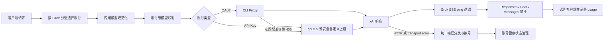

# Grok 上游对齐与稳定性优化实施计划

**生成日期**：2026-08-08
**复杂度**：高
**实施原则**：选择性移植、小步提交、每阶段可运行/可验证/可回滚
**数据影响**：本批不新增 migration，不直接访问或修改数据库数据

## Overview

本计划解决的不是“把 Pixel 的 Grok 代码整体替换成上游版本”，而是让 Grok 的正常调用链在协议和错误处理层面与上游稳定实现对齐，同时保留 Pixel 已经形成的本地业务合同。

对齐范围：

- Grok 手工连接测试与配额探针的请求形状。
- Responses、Chat Completions、Messages 三条文本兼容链路的 SSE 与 transport error 处理。
- CLI Proxy 特定兼容性 403 的安全回放。
- 401/402/403/429/5xx 对账号健康状态、换号与 `pool_mode` 的一致治理。
- 图片/视频请求字段、账号级模型映射以及视频任务绑定顺序。

保留的本地差异：

- 非 `pool_mode` 的单凭据账号遇到 402 时继续永久进入 `error`，不采用上游 30 分钟冷却。
- OAuth 凭据状态更新继续使用本地 credential snapshot CAS，防止旧请求污染新凭据。
- 继续保留账号广场、共享模式、自定义 `base_url`/header override、迁移 262、媒体 eligibility、owner binding、安全代理和计费逻辑。
- 不整体 merge/cherry-pick 上游 Grok 大包，不降级本地 Grok CLI 版本。

目标调用链如下：

## 已确认问题与证据

| 严重度 | 已确认问题 | 可复核证据 | 影响 | 建议 | 置信度 |
|---|---|---|---|---|---|
| P1 | Grok 手工探针仍携带 `max_output_tokens: 16`，配额探针仍携带 `max_output_tokens: 1` 与 `store: false` | `backend/internal/service/account_test_service.go:1480-1500`；`backend/internal/service/grok_quota_service.go:562-574`；上游 `buildGrokQuotaProbeBody` 仅发送 `model/input/stream` | 推理模型可能以 `response.incomplete(max_output_tokens)` 结束，健康账号被误判失败 | 共享一套最小探针 body，保留 terminal/incomplete 的严格判定 | High |
| P1 | Grok 上游注入的 `event: ping` 会进入严格 Responses 客户端 | 本地尚无 Grok SSE filter；上游 `baaae8e12`、`30967d5d9` 增加专用过滤器并限制候选帧缓冲 | Grok CLI/Codex CLI 可能因未知事件中止整轮 | 按上游最终状态机移植，并覆盖所有本地 Grok SSE 消费者 | High |
| P1 | Grok Chat 和 Grok Messages 的 transport error 会先写 502，绕过统一换号 | Responses 已在 `backend/internal/service/openai_gateway_grok.go:112-115` 调用统一 helper；Chat 在同文件 `343-357`、Messages 在 `backend/internal/service/openai_gateway_messages.go:265-278` 直接写错误 | 响应一旦提交便不能换号，短暂代理/DNS/TCP 故障直接暴露给客户端 | 在未提交响应时统一返回 `UpstreamFailoverError` | High |
| P1 | `pool_mode` 只跳过部分 5xx 处罚，没有覆盖默认 401/402/403/429 状态写入 | `backend/internal/service/openai_gateway_grok.go:907-940`；`backend/internal/service/account.go:1467-1474` 的池模式合同；上游 `4d13925c9`、`5c9629ddb` | 聚合池某个成员异常会错误污染本地“账号”健康状态 | 显式管理员 403 规则之后统一旁路默认健康处罚 | High |
| P1 | live 429 尚未完整复用已有持久化配额窗口和成功恢复逻辑 | 现有 helper 位于 `backend/internal/service/grok_quota_state.go:97-190`；live 分支仍在 `openai_gateway_grok.go:931-936` 使用普通临时禁用 | 重启或多实例后限流窗口可能失真，恢复也不及时 | 接入 snapshot、reset、durable rate limit 与 CAS 清理 | High |
| P1 | 视频生成成功响应先提交，owner binding 后写且失败只记录日志 | `backend/internal/service/grok_media.go:488-536` 先写响应；`backend/internal/handler/grok_media.go:401-411` 后绑定 | 客户端拿到 request ID 后，status/content 可能因找不到原账号而失败 | 拆分 prepare/commit，绑定成功后才能提交成功响应 | High |
| P2 | 媒体请求只覆盖部分 `image_url` 形状，缺少 `reference_images` 和完整账号模型映射 | `backend/internal/service/grok_media.go:151-200,702-779`；上游 `456c6193`、`335edde9` | 图片/视频输入被漏读或模型路由、计费模型不一致 | 先规范字段，再做内建别名与账号映射 | High |

### 待确认风险

- 线上现存报错分别由 ping、transport、429 状态还是媒体绑定触发，仍需实际日志中的 endpoint、status、request ID 交叉确认；本计划不把缺少线上证据的单一猜测当成根因。
- Chat/Messages 响应体缺少统一 idle timeout、Grok WebSocket 在 upgrade 前没有明确拒绝，均已从代码确认存在风险，但会扩大本批 transport 合同，列入后续独立评审，不混入当前推荐批次。

## Prerequisites

- 保留当前工作区中用户已有的修改：
  - `backend/internal/service/account_test_service.go`
  - `backend/internal/service/account_test_service_openai_test.go`
- 实施时先保存基线：`git status --short`、当前 commit、上述两文件的 diff；禁止回退或覆盖这些改动。
- 本地已存在 `upstream` remote 和所需提交对象；只读取提交内容，不直接 cherry-pick Grok 大包。
- 不新增第三方依赖；优先复用现有 HTTP upstream、SSE scanner buffer、Ops error、CAS 和 quota state helper。
- 真实 xAI smoke 需要专用的非生产 OAuth Free/付费账号和 API Key，禁止使用生产凭据做探索性测试。
- Windows 本机没有可用 gcc 时不运行 `-race`；使用定向单测、包级回归、`go vet` 和发布构建门替代。
- 本批出现任何新 migration 都视为范围漂移并阻断实施，另行评审。

## 冻结的行为合同

| 场景 | 非 pool 账号 | `pool_mode` 账号 |
|---|---|---|
| 内容策略 403 | 不处罚账号，不按账号故障换号 | 不处罚账号 |
| 管理员显式 403 规则 | 规则优先执行 | 规则仍优先执行 |
| 默认 401 | OAuth 使用凭据 CAS 临时禁用；API Key 按现有策略处理 | 不写 `error`、temp、rate-limit 等本地健康状态 |
| 默认 402 | 永久 `error`，保留本地 CAS 与人工恢复语义 | 不写本地健康状态 |
| 默认 403 | 临时禁用并允许换号 | 不写本地健康状态 |
| 429 | 按 header/reset 持久化限流窗口，成功响应按观测代际清理 | 只保留可观测快照，不写 durable/runtime 健康状态 |
| 5xx | 短冷却并换号 | 不写本地健康状态；请求是否同账号重试仍由 pool 配置决定 |

账号健康状态与当前请求的 failover 是两个维度：`pool_mode` 旁路本地状态写入，不代表吞掉上游错误，也不改变显式的同账号重试次数或可换号判定。

## Sprint 1：文本核心链路止血

**目标**：消除探针误报、严格客户端 ping 崩溃和 transport error 无法换号。
**可演示增量**：OAuth/API Key 的 Responses、Chat、Messages 均能完成正常文本请求；ping 不再暴露给严格客户端；连接级错误在响应提交前进入现有换号循环。

### Task 1.1：统一 Grok 健康探针请求协议

- **建议提交**：`fix(grok): align health probe request shape`
- **位置**：
  - `backend/internal/service/account_test_service.go`
  - `backend/internal/service/account_test_service_openai_test.go`
  - `backend/internal/service/grok_quota_service.go`
  - `backend/internal/service/grok_quota_service_test.go`
  - 可新增单一职责文件 `backend/internal/service/grok_probe_request.go` 及对应测试
- **描述**：
  - 只保留 `model`、`input`、`stream: true`；`input` 使用字符串，手工测试传入用户 prompt 或默认 `hi`，配额探针固定 `hi`。
  - 移除 Grok 的 `max_output_tokens` 和 `store`；若 `openAITestMaxOutputTokens` 已无调用则一并删除，避免僵尸常量。
  - 手工测试和配额探针共用 builder，避免两套 wire shape 再次漂移。
  - `Accept` 统一为 `application/json, text/event-stream`，保留 redirect 禁用、自定义安全 `base_url`、header override 与敏感信息规则。
  - 保留现有 `response.completed/done` 成功、`response.incomplete/failed` 失败、无 terminal 的 EOF 失败语义。
- **依赖**：无；实施时必须先合并并保留用户当前 OpenAI 探针改动。
- **验收标准**：
  - OAuth/API Key、默认/自定义 `base_url` 的实际请求体都不含 `max_output_tokens`、`store`、`tools`、`tool_choice`。
  - 200 只有在收到 terminal 事件时成功；`response.incomplete(max_output_tokens)` 显式失败且展示 reason。
  - 401/402/403/429/5xx 不得持久化伪造的成功配额数据。
- **验证**：
  - `go test -C backend ./internal/service -run "Test(CreateGrok|BuildGrokQuota|AccountTestService.*Grok|GrokQuotaService)" -count=1`

### Task 1.2：移植最终版 Grok SSE ping 过滤状态机

- **建议提交**：`fix(grok): filter upstream SSE ping frames`
- **上游依据**：`baaae8e12` + `30967d5d9`，实现直接以 `30967d5d9` 的最终版为准。
- **位置**：
  - 新增 `backend/internal/service/openai_gateway_grok_sse_filter.go`
  - 新增 `backend/internal/service/openai_gateway_grok_sse_filter_test.go`
- **描述**：
  - `event: ping` 且 data 未声明冲突事件类型时改写为 `: ping\n\n`。
  - 非 ping 帧逐行直通；只缓存 ping 候选帧。
  - 候选帧限制为 16 行/16 KiB，超限后原样回放并转直通；单行仍服从现有 `Gateway.MaxLineSize`。
  - 保证 source `Close` 只传播一次，read/close error 不被吞掉。
  - 复用本地 SSE scanner buffer/helper；若签名不同，按本地接口适配，不复制同义 helper。
- **依赖**：无。
- **验收标准**：
  - `event: ping` 不出现在过滤后输出中；`: ping` 数量与可过滤帧一致。
  - 非 ping、未知字段、超限候选帧 byte-for-byte 保留。
  - LF、CRLF、bare CR、坏 JSON、EOF 半帧、source error、close error 均有测试。
  - terminal 和 usage 不丢失，缓冲不能随无限帧增长。
- **验证**：
  - `go test -C backend ./internal/service -run "TestGrokResponsesBillingPingFilter" -count=1`

### Task 1.3：把 ping filter 接入所有 Grok 文本 SSE 消费者

- **建议提交**：与 Task 1.2 同一提交，或在代码审查需要缩小 diff 时独立为 `fix(grok): apply ping filter to text compatibility paths`。
- **位置**：
  - `backend/internal/service/openai_gateway_grok.go`
  - `backend/internal/service/openai_gateway_chat_completions.go`
  - `backend/internal/service/openai_gateway_messages.go`
  - 对应 Grok/Chat/Messages 测试
- **描述**：
  - 封装一个复用入口计算 `maxLineSize` 并包装 Grok SSE body。
  - Responses 的包装顺序固定为：原始 body → ping filter → 本地 client-tool stream transformer → 通用 stream handler。
  - Chat 与 Messages 的上游 Responses 流在进入 buffered/streaming 转换器前也使用同一过滤器；JSON 与媒体响应不得包装。
- **依赖**：Task 1.2。
- **验收标准**：
  - Responses、Chat streaming、Chat buffered、Messages streaming/non-streaming 的 ping 后 terminal 均可完成。
  - 非 Grok 流和媒体返回完全不变。
  - client-tool mapping 开/关均保留 terminal、usage 和工具事件。
- **验证**：
  - `go test -C backend ./internal/service -run "Test.*Grok.*(Ping|Stream|Chat|Messages|Usage|Terminal)" -count=1`

### Task 1.4：统一 Grok Chat 与 Messages transport error

- **建议提交**：`fix(grok): preserve text transport failover`
- **上游行为参考**：`65fa7289`；本地按现有 Grok 分支手写适配，不机械套用上游文件结构。
- **位置**：
  - `backend/internal/service/openai_gateway_grok.go`
  - `backend/internal/service/openai_gateway_messages.go`
  - `backend/internal/service/openai_upstream_transport_error.go`（只复用，除非测试证明缺少必要分类）
  - `backend/internal/service/openai_gateway_grok_test.go`
  - `backend/internal/service/openai_gateway_chat_completions_test.go`
- **描述**：
  - `forwardGrokChatCompletions` 的 `httpUpstream.Do` 错误直接交给 `handleOpenAIUpstreamTransportError`，禁止先写 502。
  - Messages 只在 `account.Platform == PlatformGrok` 时走统一 helper；非 Grok 行为不在本任务扩张。
  - 保留客户端取消、持久代理错误、DNS/TCP/TLS 分类和现有 Ops 脱敏记录。
- **依赖**：无，可与 Task 1.2 并行；集成测试依赖 Task 1.3。
- **验收标准**：
  - 响应未提交时返回 `UpstreamFailoverError`，handler 可以换号。
  - transport error 不向 client writer 写入 body；最终用尽账号后才由 handler 统一返回安全错误。
  - 客户端主动取消不触发无意义换号。
- **验证**：
  - `go test -C backend ./internal/service -run "Test.*Grok.*Transport|Test.*UpstreamTransport.*Grok|Test.*Messages.*Grok.*Failover" -count=1`

### Task 1.5：扩展 `invalid encrypted_content` envelope 识别

- **建议提交**：`fix(grok): harden encrypted reasoning retry`
- **上游依据**：`e14fb2b6`、`ef88cf3f8`。
- **位置**：
  - `backend/internal/service/openai_gateway_grok.go`
  - `backend/internal/service/openai_gateway_grok_reasoning.go`
  - `backend/internal/service/openai_gateway_grok_test.go`
  - `backend/internal/service/openai_gateway_grok_tool_protocol_test.go`
- **描述**：
  - 识别 flat/nested error envelope、`invalid_encrypted_content` code 及 decrypt/unmodified 兼容文案。
  - 只删除被拒绝的 encrypted reasoning 项，保留 JSON number 精度、cache identity、路由账号与其他输入。
  - 同一请求最多安全重试一次；Messages bridge 使用 context marker 防止外层再次重试。
- **依赖**：Task 1.4，以保证重试过程的 transport error 仍进入统一换号。
- **验收标准**：
  - 所有已知 envelope 能触发一次清理重试；不匹配错误与无 encrypted reasoning 的 body 不重试。
  - 第二次仍失败时原样进入错误处理，不形成循环。
  - Ops request body 更新为重试后的脱敏 body，不记录 encrypted payload 明文。
- **验证**：
  - `go test -C backend ./internal/service -run "Test.*Grok.*Encrypted|Test.*Grok.*Reasoning" -count=1`

### Sprint 1 Demo/Validation

- 本地 fake upstream 依次发出 ping、delta、completed，Responses/Chat/Messages 都返回成功且 usage 正确。
- 注入 DNS/TCP 错误，确认首个账号未提交响应、第二账号可继续请求。
- 注入 `response.incomplete(max_output_tokens)`，确认探针失败原因清晰且不会把账号误记为成功。
- 运行：
  - `go test -C backend ./internal/service -run "Test.*Grok|Test.*Messages.*Grok" -count=1`
  - `go vet -C backend ./internal/service/...`

## Sprint 2：错误状态机、限流与安全回放

**目标**：让 HTTP 错误、账号状态与请求 failover 各司其职，避免池账号被错误处罚，并让 live 429 在重启/多实例条件下保持一致。
**可演示增量**：表驱动注入 401/402/403/429/5xx 后，普通账号与 pool 账号的状态 mutation 精确符合冻结合同。

### Task 2.1：统一 `pool_mode` 默认健康处罚旁路

- **建议提交**：`fix(grok): preserve pool account health`
- **上游依据**：参考 `4d13925c9`、`5c9629ddb` 的规则顺序；不得 cherry-pick 上游 402 冷却语义。
- **位置**：
  - `backend/internal/service/openai_gateway_grok.go`
  - `backend/internal/service/grok_credential_failure.go`
  - `backend/internal/service/openai_gateway_grok_test.go`
  - `backend/internal/service/grok_upstream_errors_test.go`
  - `backend/internal/service/grok_quota_service_test.go`
- **描述**：
  - 处理顺序固定为：内容策略拒绝 → 显式管理员 403 规则 → pool 默认状态旁路 → 普通账号 401/402/403/429/5xx。
  - 在 402 公共 helper 内增加 pool 防护，覆盖 live、手工测试、quota、模型同步等全部调用者。
  - 非 pool 402 继续调用 `setGrokPaymentRequiredErrorIfMatch`，保留永久 error、CAS 和 runtime block。
  - pool 旁路只禁止本地健康 mutation；原始错误、failover、同账号 retry 仍按现有请求策略执行。
- **依赖**：Sprint 1 完成，避免状态测试被提前提交的 transport error 干扰。
- **验收标准**：
  - pool 默认 401/402/403/429/5xx 的 `SetError`、temp unschedule、durable rate-limit、runtime block 调用数全部为 0。
  - 显式管理员 403 规则在 pool 下仍生效；内容策略 403 对所有账号处罚为 0。
  - 非 pool 402 永久 error；OAuth CAS miss 时不得阻塞已经轮换的新凭据。
- **验证**：
  - `go test -C backend ./internal/service -run "Test.*Grok.*(Pool|402|403|Credential|UpstreamError)" -count=1`

### Task 2.2：把 live 429 接入现有 durable quota state

- **建议提交**：`fix(grok): persist live rate limit windows`
- **上游依据**：只参考 `1dedb2097` 的接线思路和 `5c9629ddb` 的 pool 修正，不移植 quota 大包。
- **位置**：
  - `backend/internal/service/openai_gateway_grok.go`
  - `backend/internal/service/grok_quota_state.go`（优先复用，只有证据证明接口不足时才改）
  - `backend/internal/service/grok_upstream_errors_test.go`
  - `backend/internal/service/openai_gateway_grok_test.go`
- **描述**：
  - 让 usage snapshot 更新获得完整 `account`，统一执行 `ObserveQuotaHeaders`、`grokRateLimitResetAtForAccount`、`persistGrokRateLimit`。
  - 429 根据可信 quota/reset/Retry-After 建立 runtime + durable 窗口；缺失或非法 header 使用现有受控默认值。
  - 成功响应只清理由本次观测代际确认过期的限流状态，继续使用 `ClearRateLimitIfObserved` 防止旧成功覆盖新 429。
  - pool 只更新中性 snapshot，不写 health；持久化失败显式记录，不能假装成功。
- **依赖**：Task 2.1。
- **验收标准**：
  - 429 带/不带/非法/超大 Retry-After 均得到受控 reset。
  - 重复 429 只能延长不能缩短已有窗口；旧成功响应不能清除更新的窗口。
  - pool 的 durable/runtime mutation 为 0，但 snapshot 可观测。
  - Responses、Grok Chat、Messages、媒体共同走同一状态规则，不复制实现。
- **验证**：
  - `go test -C backend ./internal/service -run "Test.*Grok.*(RateLimit|Quota|429|Recovery)" -count=1`

### Task 2.3：实现 CLI Proxy 特定 403 的窄匹配安全回放

- **建议提交**：`fix(grok): safely replay CLI compatibility 403`
- **上游依据**：`115116e8b` 提供 transport 骨架，`2946281a` 收紧结构化错误识别；按最终行为适配本地 transport。
- **位置**：
  - `backend/internal/repository/http_upstream.go`
  - `backend/internal/repository/http_upstream_test.go`
- **描述**：
  - 只匹配：原 host 精确为 `cli-chat-proxy.grok.com`、403、Bearer OAuth、`X-XAI-Token-Auth: xai-grok-cli`、请求 `GetBody` 可重放、错误 body 命中受控兼容文案/结构化 code。
  - 使用同一底层 transport 与代理将 scheme/host 改为 `https://api.x.ai`，保留 path/query/body/Authorization，清理所有 CLI 身份头和 `User-Agent`。
  - 只有 fallback 返回 2xx 时替换原响应；fallback transport error 或非 2xx 时关闭 fallback body，并恢复/返回原 403 与原 body。
  - body 判定设置 64 KiB 上限；禁止 redirect，禁止递归 fallback，禁止把 entitlement/subscription/content-policy 403 当作兼容错误。
  - 当前 `TestHTTPUpstreamDoPreservesGrokCLIForbiddenWithoutRetry` 将被行为变更替换为窄匹配正反矩阵，不能简单删除保护面。
- **依赖**：Task 2.1；回放成功必须先于账号 403 状态治理，回放失败仍进入原状态机。
- **验收标准**：
  - 精确兼容性 403 只回放一次，request body 完整一致，fallback 不含 CLI 身份头。
  - 非 CLI host、API Key、无 `GetBody`、401/429、entitlement 403、畸形/超大 body 均不回放。
  - fallback 失败时客户端和状态机看到原 403，而不是 fallback 错误。
  - `Do` 与 `DoWithTLS` 行为一致，且不改变本地 `xai.CLIClientVersion`。
- **验证**：
  - `go test -C backend ./internal/repository -run "Test.*Grok.*(AccessDenied|Fallback|Forbidden|CLI)" -count=1`

### Sprint 2 Demo/Validation

- 用 fake repo 对普通 OAuth、普通 API Key、pool API Key 注入完整错误矩阵，检查 mutation 调用数、failover 和返回状态。
- 用 fake RoundTripper 演示 CLI compatibility 403 → 官方 API 2xx；再演示 entitlement 403 保留原响应。
- 运行：
  - `go test -C backend ./internal/service ./internal/repository -run "Test.*Grok|Test.*HTTPUpstream.*Grok" -count=1`
  - `go vet -C backend ./internal/service/... ./internal/repository/...`

## Sprint 3：图片/视频协议与任务一致性

**目标**：完成媒体请求字段兼容、模型映射与视频任务可查询性，同时不覆盖本地媒体安全、共享和计费链。
**可演示增量**：`url`/`image_url`/`reference_images` 均能正确转发；账号模型映射生效；返回的视频 request ID 必定已经绑定到可查询账号。

### Task 3.1：规范媒体 URL 字段并支持 `reference_images`

- **建议提交**：`fix(grok): normalize media image references`
- **上游依据**：`456c6193`。
- **位置**：
  - `backend/internal/service/grok_media.go`
  - `backend/internal/service/grok_media_test.go`
  - `backend/internal/service/grok_media_content_test.go`
- **描述**：
  - JSON 输入接受对象中的 `url` 和旧 `image_url`，解析 `image`、`images`、`reference_images`、`mask`。
  - 只对明确媒体 URL 字段做 canonicalization，上游对象统一发送 `url`；未知字段、数组顺序和大整数不变。
  - multipart、远程 URL、data URL、mask 与 moderation body 保留现有限制和 SSRF/allowlist 检查。
- **依赖**：Sprint 2 完成，媒体 HTTP 错误先共享稳定状态机。
- **验收标准**：
  - 新旧字段和混合数组均正确解析、moderation、转发。
  - `reference_images` 不丢失；空值与错误类型 fail-fast。
  - 其他 JSON 字段 byte/value 语义不变；媒体响应不经过 SSE ping filter。
- **验证**：
  - `go test -C backend ./internal/service -run "Test.*GrokMedia.*(Image|Reference|JSON|Multipart|Moderation)" -count=1`

### Task 3.2：按正确顺序应用媒体模型映射并统一计费模型

- **建议提交**：`fix(grok): apply account media model mapping`
- **上游依据**：`335edde9`。
- **位置**：
  - `backend/internal/service/grok_media.go`
  - `backend/internal/service/grok_media_test.go`
  - `backend/internal/handler/grok_media.go`
  - `backend/internal/handler/grok_media_test.go`
- **描述**：
  - 顺序固定为：解析请求模型 → 按 endpoint/是否有输入图应用内建规范化 → `account.GetMappedModel` → sanitize → 发送。
  - `OpenAIForwardResult.UpstreamModel` 使用实际发送模型；`Model` 保留客户端模型；`BillingModel` 按项目现有映射合同取最终可计费模型。
  - 不改变 eligibility、账号选择、signed content proxy、共享模式和每秒视频计费策略。
- **依赖**：Task 3.1。
- **验收标准**：
  - 图片生成/编辑、纯文本视频/参考图视频的内建别名正确。
  - 账号 mapping 在内建规范化后生效，最终 request body、Ops upstream model 与 usage billing model 一致。
  - 未配置 mapping 时保持当前默认模型行为。
- **验证**：
  - `go test -C backend ./internal/service ./internal/handler -run "Test.*Grok.*(Media.*Model|Model.*Mapping|Billing)" -count=1`

### Task 3.3：将媒体响应改为 prepare/commit 两阶段（行为保持）

- **建议提交**：`refactor(grok): prepare media response before commit`
- **位置**：
  - `backend/internal/service/grok_media.go`
  - `backend/internal/handler/grok_media.go`
  - 对应 service/handler 测试
- **描述**：
  - 为非 content 的缓冲媒体响应引入内部 `GrokMediaPreparedResponse`，包含 result、status、filtered headers 与 body；service 完成上游读取和校验但不写 client writer。
  - handler 显式调用 commit helper 后才提交响应；本任务先保持原有调用顺序与输出完全一致。
  - 视频 content/Range 的 streaming 路径保持现状，不强行缓冲。
- **依赖**：Task 3.2。
- **验收标准**：
  - 重构前后成功/错误 status、headers、body、usage 完全一致。
  - failover 判断仍以 writer 是否未提交为准；非 content 响应在 commit 前 writer size 不变。
- **验证**：
  - `go test -C backend ./internal/service ./internal/handler -run "Test.*GrokMedia" -count=1`

### Task 3.4：视频 owner binding 成功后再提交响应

- **建议提交**：`fix(grok): bind video tasks before response commit`
- **位置**：
  - `backend/internal/service/grok_media.go`
  - `backend/internal/handler/grok_media.go`
  - `backend/internal/service/grok_media_test.go`
  - `backend/internal/handler/grok_media_test.go`
- **描述**：
  - video mutation 从 prepared response 提取 request ID，先完成 owner + routing binding，再 commit 成功响应。
  - 两次 cache 写入保持幂等；第二步失败时清理由本次创建的部分绑定，错误向上返回，禁止假装成功。
  - binding 失败时不返回成功 request ID、不报告账号调度成功、不写标准成功 usage；记录脱敏 Ops orphan-task 事件供排查。
  - status/content 查询继续强制 owner 隔离，不增加“随便找账号”的 fallback。
- **依赖**：Task 3.3。
- **验收标准**：
  - 所有返回 2xx 的视频 mutation request ID 都可以立即查询 status，并由同一 owner 获取 content。
  - cache 不可用、第一步/第二步写失败时 writer 未提交成功响应，且部分绑定被清理。
  - 他人 user/API Key 查询仍被拒绝；旧任务兼容迁移逻辑保留。
- **验证**：
  - `go test -C backend ./internal/service ./internal/handler -run "Test.*Grok.*Video.*(Bind|Owner|Status|Content|Mutation)" -count=1`

### Sprint 3 Demo/Validation

- 用 fake xAI 返回视频 request ID，立即请求 status/content，确认绑定、路由和 owner 隔离。
- 注入 cache 第二次写失败，确认客户端没有收到 2xx/request ID，且没有成功 usage。
- 运行：
  - `go test -C backend ./internal/service ./internal/handler -run "Test.*GrokMedia" -count=1`
  - `go vet -C backend ./internal/service/... ./internal/handler/...`

## Sprint 4：全链路回归、观测与分阶段发布

**目标**：建立可证明的发布门、canary 验证和无数据库回滚路径。
**可演示增量**：每个 Sprint 都有独立 commit/版本，可在 staging 或专用 Grok Key 上完成验收，并能回到上一二进制。

### Task 4.1：执行统一回归与安全门

- **建议提交**：无代码变化时不单独提交；测试补丁跟随对应功能提交。
- **位置**：现有 service/repository/handler/pkg 测试。
- **依赖**：Sprint 1-3。
- **验收标准**：
  - 定向与包级测试全绿，`go vet` 全绿，`git diff --check` 无错误。
  - 无新 migration、无新增依赖、无临时脚本/调试文件。
  - Authorization、access/refresh token、API Key、完整 credentials、prompt、完整 upstream body 不进入日志或测试产物。
- **验证命令**：
  - `go test -C backend ./internal/service/... ./internal/repository/... ./internal/handler/... ./internal/pkg/xai/... -count=1`
  - `go vet -C backend ./...`
  - `git diff --check`
  - `git status --short`

### Task 4.2：专用账号真实上游 smoke

- **位置**：不创建持久测试脚本；通过现有 API/管理端和专用非生产凭据执行。
- **依赖**：Task 4.1；需用户提供或确认可用的专用测试账号。
- **验收标准**：
  - OAuth Free/付费、API Key 各完成一次 Responses 流式调用并收到 terminal。
  - Chat streaming/non-streaming、Messages streaming 各一次；严格客户端不再看到 `event: ping`。
  - CLI compatibility 403 仅在真实命中时观察回放；不得人为破坏生产账号制造 403。
  - 媒体只使用已授权付费沙箱账号做最低成本图片；视频生成需再次确认费用后才执行。

### Task 4.3：按 Sprint 独立发布与观察

- **位置**：现有 Pixel 发布流程；不修改数据库 schema。
- **依赖**：Task 4.2。
- **描述**：
  - 推荐发布顺序：Sprint 1 → 观察 → Sprint 2 → 观察 → Sprint 3。
  - 每阶段独立 commit、独立版本、独立 release 目录和回滚点。
  - 当前生产为单实例 `pixel.service` + `/opt/sub2api/current` symlink，没有权重路由；因此只能在切换后先用专用 canary Key/分组验证，不能把它称为 1%/10% 流量灰度。
  - canary 全绿后先观察 30 分钟，再观察 24 小时账号状态变化后进入下一阶段。
- **验收标准**：
  - staged binary 的 ELF、SHA、version、BuildType 正确，`/health/ready` 为 200。
  - Grok 非上游归因的 5xx/terminal-missing 不高于基线。
  - 错误率上升超过 2 个百分点、P95 上升超过 20%、RSS 持续上升超过 10% 时暂停并回滚。

## Testing Strategy

### 单元/集成矩阵

| 维度 | 覆盖值 |
|---|---|
| 账号 | OAuth、API Key、`pool_mode` API Key |
| 上游地址 | CLI Proxy、`api.x.ai`、合法 custom/region base URL、拒绝的越界 URL |
| endpoint | Responses、Chat Completions、Messages、quota、images、video mutation/status/content |
| HTTP | 200、401、402、内容策略/显式规则/默认 403、429、502/503/504 |
| SSE | LF、CRLF、bare CR、ping 非零 cost、无 data、坏 JSON、EOF 半帧、超 16 行/16 KiB、terminal 缺失 |
| 状态 | CAS 命中/未命中、repo 失败、旧成功晚到、新 429 晚到、pool 零 mutation |
| 媒体 | `url`、`image_url`、`reference_images`、multipart、data URL、模型别名/mapping、binding 两步故障 |

### 必须保留的回归

- Grok 自定义 `base_url`、redirect 禁用、allowlist 与 header override。
- OAuth refresh token 未轮换时保留旧 token；CAS miss 不覆盖新凭据；错误文本脱敏。
- Responses client tool round-trip、prompt cache、compact、usage、terminal。
- 媒体 eligibility、owner 隔离、signed content URL、Range/416、non-2xx、每秒视频计费。
- OpenAI 非 Grok 的 Responses/Chat/Messages 行为保持不变。

## 可观测性与发布阻断

优先复用现有 Ops error 和结构化日志，不为本批引入新的遥测依赖。需要观察：

- `platform=grok` 的 upstream status、kind、request ID、failover 次数。
- probe 的 completed/incomplete/terminal-missing。
- ping filtered 总量、oversize passthrough、scanner/read/close error；正常每个 ping 不打高频明细日志。
- `grok_pool_mode_error_state_skipped`、账号 error/temp/rate-limit mutation、CAS miss。
- CLI fallback 命中/成功/失败，但不记录 Authorization、body 或用户输入。
- 视频 binding 成功/失败、orphan-task 计数；只记录 account ID 与安全 request ID。
- `No healthy Grok account`、P95、RSS、goroutine 和上游连接数。

以下任一项发生即阻断发布或立即回滚：

- pool 默认错误产生一次本地健康 mutation。
- 内容策略 403 产生一次账号处罚。
- terminal 或 usage 丢失一次；严格客户端再次收到 `event: ping`。
- OAuth 新凭据被旧请求覆盖，或 custom base URL 越界。
- 已返回成功的视频 request ID 无法查询 status/content。
- readiness 非 200、进程重启增加、敏感信息进入日志。
- 产生未评审的 migration、依赖或大范围上游文件覆盖。

## Potential Risks & Gotchas

- **SSE 包装顺序**：ping filter 必须位于 client-tool transformer 之前，否则未知 ping 可能先进入严格 JSON/event 解析器。
- **原响应 body 恢复**：CLI fallback 为判断 403 会读取 body；所有“不回放/回放失败”分支都必须恢复原 body，否则后续错误分类会看到空响应。
- **403 误分类**：`permission_denied` 不是充分条件，必须同时匹配 CLI host、身份头和完整受控文案，防止绕过 entitlement/内容策略。
- **pool 与 failover 混淆**：旁路的是健康 mutation，不是错误；不可因 pool 跳过状态而返回伪成功。
- **402 语义冲突**：上游是 30 分钟冷却，本地是永久 error。本计划已冻结保留本地语义，禁止顺手移植 `2db0cbd29`/`ca0d3314c`。
- **429 乱序**：成功清理必须有观测代际/CAS；无条件 clear 会让晚到响应恢复仍受限账号。
- **媒体部分绑定**：owner/routing 两步写需幂等和补偿；不能以“后续再修复”为由返回不可查询的成功 ID。
- **工作区重叠**：Task 1.1 与用户已有两个文件重叠，必须以当前工作区版本为基线做最小 patch。

## 明确不移植/不在本批实施

- 不整体移植 `343390057` OAuth credential 大包、`c896cacf6` quota 大包、`7050070aa` Chat→Responses 大桥、`7840eb1c4` WS bridge。
- 不移植上游 402 临时冷却提交 `2db0cbd29`、`ca0d3314c`。
- 不移植会把本地 CLI `0.2.118` 降到 `0.2.114` 的 `b74cb7891`。
- 不采纳未经实时核实的 Free 配额政策常量 `d2753dc2e`。
- 不在本批新增 Grok WebSocket 支持，也不在多条转换器中仓促复制 idle-timeout 逻辑；后续应单独设计共享 SSE line pump/watchdog，并在 upgrade 前明确 Grok WS 支持边界。
- 不做数据库 migration、数据修复、生产凭据试探或真正的百分比流量灰度。

## Rollback Plan

- 每个 Sprint 使用独立 commit 和二进制版本，不把三个 Sprint 压成一个不可拆回的发布。
- 回滚只切换 `/opt/sub2api/current` 到上一 release、重启 `pixel.service`、轮询 `/health/ready`；本批没有 schema rollback。
- 回滚后立即用同一专用 canary Key 重跑文本探针、严格 SSE、pool 状态矩阵的线上可观察部分，以及视频 status/content 查询。
- 若上一版本也复现同类上游 429/5xx，依据部署前 request ID/status 基线判定为外部故障，停止继续切版本，避免反复重启扩大影响。
- 回滚不能恢复本次已经误写的账号状态；因此 Sprint 2 发布前必须用 fake repo 证明 pool mutation 绝对为 0，并在真实 canary 期间核对账号状态变化。

## 推荐提交顺序

1. `fix(grok): align health probe request shape`
2. `fix(grok): filter upstream SSE ping frames`
3. `fix(grok): preserve text transport failover`
4. `fix(grok): harden encrypted reasoning retry`
5. `fix(grok): preserve pool account health`
6. `fix(grok): persist live rate limit windows`
7. `fix(grok): safely replay CLI compatibility 403`
8. `fix(grok): normalize media image references`
9. `fix(grok): apply account media model mapping`
10. `refactor(grok): prepare media response before commit`
11. `fix(grok): bind video tasks before response commit`

每个提交必须同时包含对应测试；任一提交不能依赖未提交的临时脚本或本地数据才能通过。
